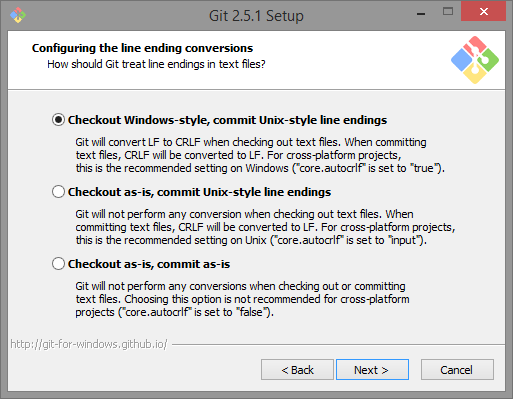
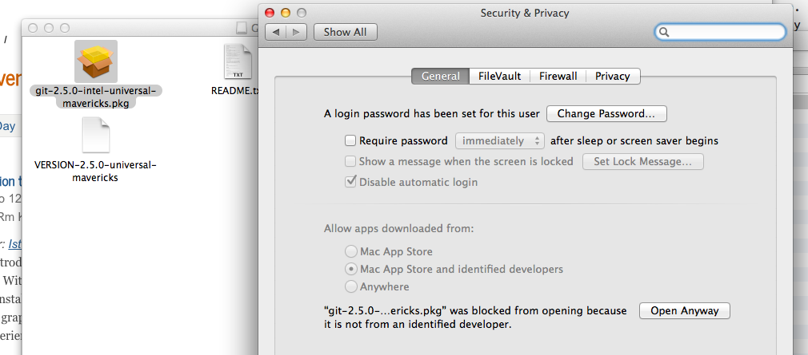

```{r global_options, include=FALSE}
knitr::opts_chunk$set(fig.pos = 'H')
```

Starting with homework 1, we will be using a specific tool to submit homework assignments other than Canvas. The tool we will be using is called git and GitHub. This is a tutorial that will help you install the tool git on your computer and create a GitHub account. 
 
  
## Create your GitHub account
  
  The first week of class we asked each of you to set up your GitHub account
  and submit your GitHub username in a survey. 
  
  To sign up for an account, just go to [github](https://github.com) 
  and pick a unique username and supply an email address and a password. 
  Once you've done that, your github page will be at 
  `https://github.com/<your-username-here>`.
  
  Github also provides a student 
  [developer package](https://education.github.com/pack). 
  This is something that might be nice to have, but it is not 
  necessary for the course. Github may take some time to approve 
  your application for the package. Please note that this is 
  optional and you do not have to have the package 
  approved to fill out the survey. 
  
  
#### Programming expectations
  
  All the lecture material and homework for this class will use R and
  R Markdown files. Knowledge of R is not a prerequisite for this course, 
  **provided you are comfortable learning on your own as needed**. 
  Basically, you should feel comfortable with:
    
  * How to look up R syntax on Google and StackOverflow.
  * Basic programming concepts like functions, loops, arrays, dictionaries, strings, and if statements.
  * How to learn new libraries by reading documentation.
  * Asking questions on Slack and StackOverflow.
  
  
## Setting up your git environment
  
### 1. Installing git
  
  We will be using the [command line version of git](http://git-scm.com/docs/gittutorial).
  
  On Linux, install git using your system package manager (yum, apt-get, etc). 
  
  On a Mac, if you ever installed [Xcode](https://developer.apple.com/xcode/),
  you should have git installed. Alternatively, you may have installed 
  it using `homebrew`. Either of these are fine as long as the 
  git version is greater than 2.0. To determine the version of git 
  that is installed on your computer, open a terminal window and type:
    
    > $ `git --version`
  
  If git is installed, you should see a version number. Check to see if it 
  is greater than version 2.0. If it is not, please update your version 
  of git. 
  
  If git is not installed on your Mac and Windows, go to http://git-scm.com. 
  Accept all defaults in the installation process. 
  On Windows, installing git will also install for you a minimal 
  unix environment with a "bash" shell and terminal window. 
  Voila, your windows computer is transformed into a unixy form.
  
#### Windows specific notes
  
  There will be an installer `.exe` file you need to click. Accept all the defaults.
  
  Here is a screen shot from one of the defaults. It makes sure you will have the "bash" tool talked about earlier.
  
  
  
  Choose the default line-encoding conversion:
    
  
  
  Use the terminal emulator they provide, its better than the one shipped with windows.
  
  
  
  Towards the end, you might see a message like this. It looks scary, but all you need to do is click "Continue"
  
  
  
  
  At this point you will have git installed. You can bring up "git bash" 
  either from your start menu, or from the right click menu on any 
  folder background. When you do so, a terminal window will open. 
  This terminal is where you will issue further git setup commands, 
  and git commands in general.
  
  Get familiar with the terminal. It opens in your home folder, and 
  maps `\\` paths on windows to more web/unix like paths with '/'. 
  Try issuing the commands `ls`, `pwd`, and `cd folder` where folder 
  is one of the folders you see when you type `ls`. You can do 
  a `cd ..` to come back up.
  
  
#### Mac specific notes
  
  As mentioned earlier, if you ever installed Xcode or the 
  "Command Line Developer tools", you may already have git.
  Make sure it's version 2.0 or higher. (`git --version`)
  
  Or if you use **Homebrew**, you can install it from there. 
  The current version on homebrew is 2.18.0
  You don't need to do anything more in this section.
  
  -----
  
  First click on the `.mpkg` file that comes when you open the 
  downloaded `.dmg` file.
  
  When I tried to install git on my mac, I got a warning saying my 
  security preferences wouldn't allow it to be installed. So I opened 
  my system preferences and went to "Security".
  
  
  
  Here you must click "Open Anyway", and the installer will run.
  
  The installer puts git as `/usr/local/git/bin/git`. 
  That's not a particularly useful spot. Open up `Terminal.app`. 
  It's usually in `/Applications/Utilities`. Once the terminal opens up, type
  
  > $ `sudo ln -s /usr/local/git/bin/git /usr/local/bin/git`
  
  Keep the Terminal application handy in your dock. 
  (You could also download and use iTerm.app, which is a nicer terminal, if you are into 
   terminal geek-ery). We'll be using the terminal extensively for git. 
  
  Try issuing the commands `ls`, `pwd`, and `cd folder` where 
  folder is one of the folders you see when you type `ls`. You 
  can do a `cd ..` to come back up.
  
 
### 2. Setting global config for git
  
  Again, from the terminal, issue the command
  
  `git config --global user.name "YOUR NAME"`
  
  This sets up a name for you. Then do
  
  `git config --global user.email "YOUR EMAIL ADDRESS"`
  
  Use the **SAME** email address you used in setting up your github account.
  
  These commands set up your global configuration. On my Mac, 
  these are stored in the text file `.gitconfig` in my home folder.
  