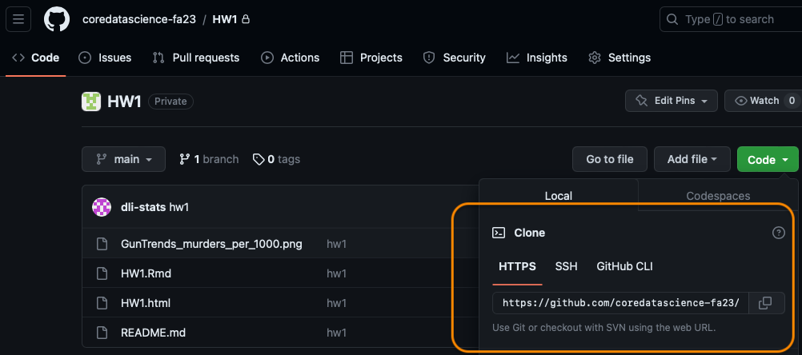
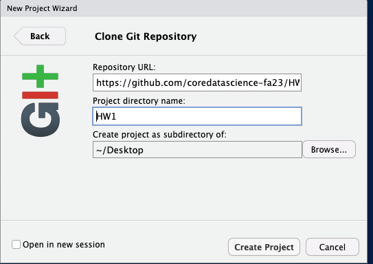
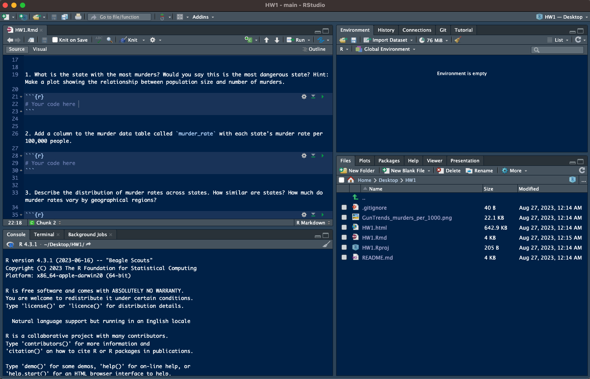
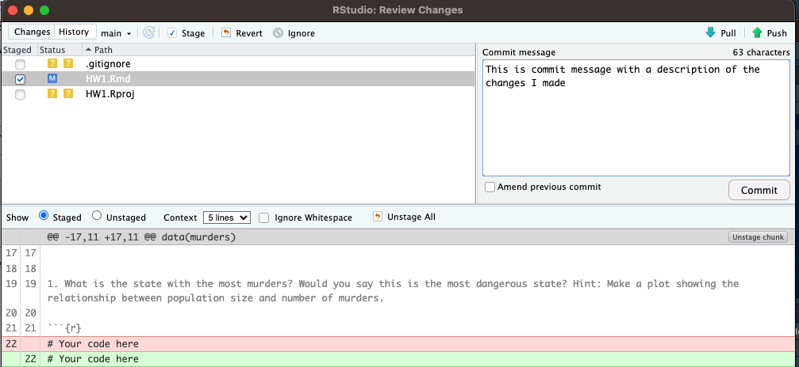

We will be using git and GitHub to get your homework assignments, work on your homework, 
and submit your homework solutions. This tutorial will walk you through 
that process using git and GitHub through RStudio.

## Configuring Github Access Token for RStudio

Before you get started working on your homework, you will need to set up your Github access token for RStudio. You should only need to do this once. First, install and load in these two packages in RStudio: 

```{r, eval = FALSE}
install.packages("usethis")
install.packages("gitcreds")
library(usethis)
library(gitcreds)
```

Make sure you that are signed in to Github on your browser and run the following line of code to create a Github token: 

```{r, eval = FALSE}
usethis::create_github_token()
```

Use the default settings and select "Generate token". Copy the generated token and run: 
```{r, eval = FALSE}
gitcreds_set()
```

Select "2. Replace these credentials" and paste the generated token that you just copied. You should be all set to proceed to cloning your homework repository! 

## Getting and Working on Homework

### Cloning your Homework repository
Each of you will be made members of the [`coredatascience-students` 
organization on GitHub](https://github.com/coredatascience-students). 
This means that your homework repositories all technically belong to us. 
But you will be granted unlimited access throughout the course!

You will notice when you visit the `coredatascience-students` 
[Github page](https://github.com/coredatascience-fa23) that you can 
only see repositories with your GitHub username on them. You will get 
one repository for each homework throughout the semester. When a new 
homework is released you can go to the corresponding repository to 
see what is in store. The work flow will be pretty simple. 

1. Go to: https://github.com/coredatascience-students

2. Click on the repository you want to work on. For 
example `<your_GitHub_username>-2024HW1` for Homework 1. 

3. Copy the link near the top of the page that is revealed after clicking 'clone or download'.



4. In RStudio, start a new project: 

> File > New Project > Version Control > Git

In the "repository URL" paste the URL of the homework repository you just copied. Take charge of – or at least notice! – the local directory for the Project. A common rookie mistake is to have no idea where you are saving files or what your working directory is. Pay attention. Be intentional. Personally, I suggest you check "Open in new session" and to keep  all your homework repositories in a 'BST219' folder.




5. Click "Create Project". You should now see the files in the repository in the lower right window in RStudio. Also notice the Git tab in the upper right window.




### Working on your homework

Once you have a local copy of your repository, it's time to get to work! 

After writing some of your homework in an `Rmd` file, `knit` it, make pretty plots, and find out some cool stuff about the dataset, it's time to `commit/push`. After some work, save your changes and click the `commit` button in the Git tab window. This is equivalent to `save` in most programs. But what is special about `git` and other version control software is that we can track and revert changes! We also need to give what's called a `commit message`, which will help us keep track of the changes we made when we look at this in the future. Leave detailed messages so that future you will know what you did. Future you will thank you. We will get to this part later. 



Cool! Now we've saved our work on our local directory, we can now `push` our work to Github by clicking the *green up-arrow* in the Git tab window. If you are asked for username and password, provide them. Note, we can (and should) do this as many times as we want before the homework deadline. What is great about this is that it will make getting help from your TF easier as well as keeping a copy of your work in the cloud in case your computer crashes, or you accidentally delete something.	


### Summary
To summarize, it is important to do the following  steps whenever you finish working on your homework to make full use of `git` and Github as well as generally having the best experience in this class. 

1. Work on your homework
2. Commit changes to your local repository: `commit` button in Git tab in RStudio
3. Push the changes to your github repo: `push` (green arrow) button in Git tab in RStudio

Generally keep this picture in mind whenever you want to do this loop, it is important to only add changed files you care about and nothing you do not care about. If certain files keep popping 
up in your git status that you will never want to add, e.g. `.Rhistory`, etc, add them to your `.gitignore` to simplify your life, this will keep those files from showing up here. 


# Late Day Policy

Each student is given up to 2 late days per homework assignment. A late day extends the individual homework deadline by 24 hours without penalty. No more than two late days may be used on any one assignment. Late days are intended to give you flexibility: you can use them for any reason no questions asked. You don't get any bonus points for not using your late days. Also, you can only use late days for the individual homework deadlines - all other deadlines (e.g., project milestones and midterm) are hard.

We made this policy because we understand that you are all busy and things happen. We hope that this added flexibility gives you the freedom to enjoy the course and engage with the material fully. 

## Some unsolicited advice

To be fair to all the students we have to enforce this late day policy, so we have put together a list of things to consider near the deadline.

Say the homework is due Friday at 11:59 pm.

1. If we do not see any more `commit`s two days after the deadline we will take 
the last `commit` as your final submission.
2. Check that the final `commit` is showing on your Github repo page. 
"I forgot to `push`" is not an acceptable excuse for late work.
3. It may help to add a message like "This is my final version of the 
homework please grade this" but that's up to you.
4. We will assess the number of late days you used and keep track.
5. You **do not** need to tell us that you will take extra days, we will 
be able to see the time stamp of your last `commit`.
6. When you are done with the homework, do not `commit` or `push` any more. 
If you `commit` and `push` after the deadline you will be charged a late day. 
This is strict.

# Happy `git`-ing
