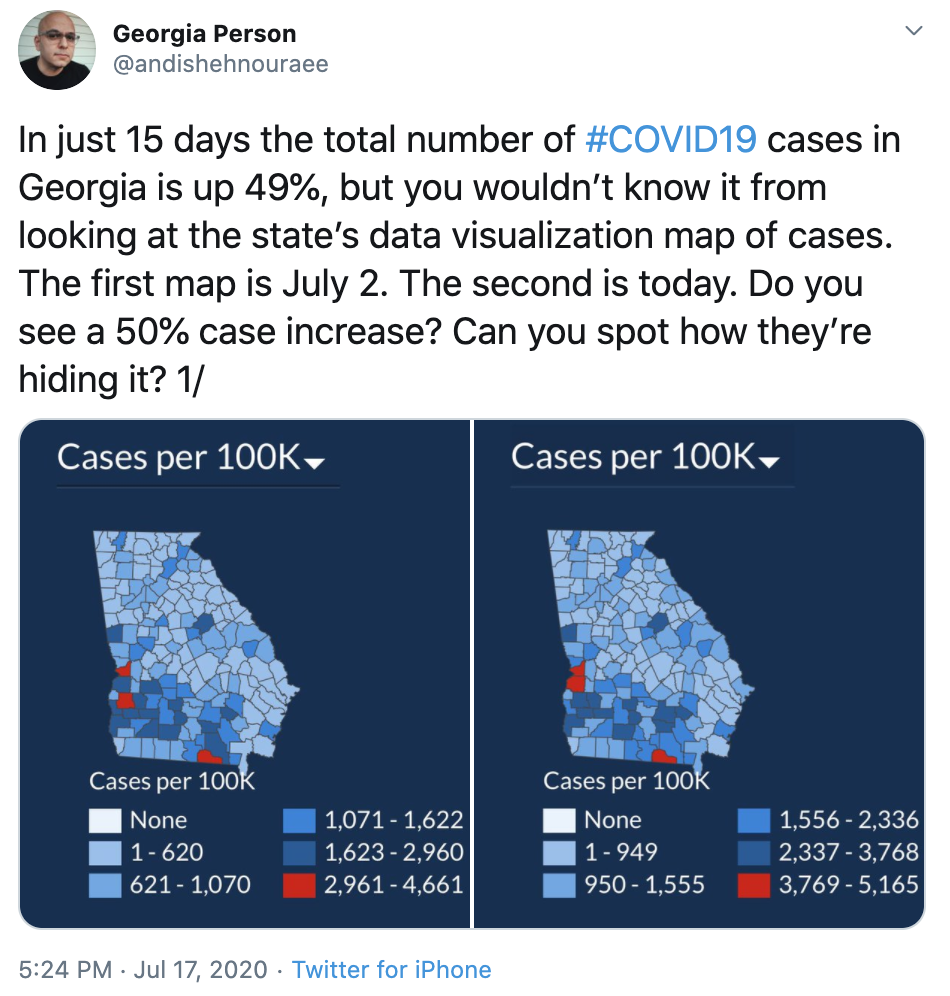

```{r setup, include=FALSE}
knitr::opts_chunk$set(echo = TRUE, message = FALSE, warning = FALSE)
setwd("~/Dropbox (Harvard University)/Teaching/2024/BST219/2023/BST219/03_data_visualization")
```

```{r, echo = FALSE, message=FALSE, warning=FALSE}
library(usmap)
library(ggplot2)
library(readr)
library(lubridate)
library(maps)
library(dplyr)
library(dslabs)
library(stringr)
```

Plots of maps can be very powerful, very informative and very aesthetically pleasing visualizations. However, they can also be misleading if not created correctly. Here we will introduce one R package for creating effective and informative maps and show how to correct a misleading set of maps. 

There are several R packages available that can be used to create plots of maps. We will be focusing on one of the packages,  `maps`, because of how intuitive it is, the data available, and because it works well with `ggplot2`. We will see several of the options available with this package, but you can read more about the `maps` package [here](https://cran.r-project.org/web/packages/maps/maps.pdf) and see more examples [here](https://eriqande.github.io/rep-res-web/lectures/making-maps-with-R.html). Other available R packages include `usmap`, `ggmap`, `ggspatial`, `sf`, `urbnmapr` and `rnaturalearth`, and we recommend exploring the examples (like [this one](https://ggplot2-book.org/maps.html)) and documentation for these packages for additional types of map plots.


### World Map

The `maps` package contains a lot of outlines of continents, countries, states, and counties. In order to map these using `ggplot2`, we must specify which type of map we want with `map_data()`. ggplot2 provides the `map_data()` as a function that turns a series of points along an outline (from the `maps` package) into a data frame of those points. Below we will see maps of the world, a few countries, the entire US, US states and US counties, but there are more options available with this package. 

We can save map data as a data frame to see what data is available and then map with `ggplot`. Let's look at the "world" option.

```{r}
# Pull out world map data frame
world_map <- map_data("world")
dim(world_map)
head(world_map)
```

We can see the latitude (`lat`) and longitude (`long`) for different regions of the world are available. Here, `region` corresponds to a country and `subregion` indicates additional information about that country if available. For example, the Virgin Islands fall into different political jurisdictions, so you'll see "British" and "US" under `subregion` for the Virgin Islands.  

The column `order` shows in which order ggplot should "connect the dots" when plotting. `group` is important since functions in `ggplot2` can take a group argument which controls (amongst other things) whether adjacent points should be connected by lines. If they are in the same group, then they get connected, but if they are in different groups then they don’t. Essentially, having two points in different groups means that ggplot “lifts the pen” when going between them. As we'll see below, including `group = group` in the `aes()` argument will plot the outlines of countries. If we don't include `group = group`, the plot will have many lines connecting different parts of different countries and will be impossible to interpret.

For this plot we also use `fill` (to denote the color to fill the countries with) and `color` (the outline color for each country). We will see more options as we create more complex maps. 

```{r}
# Basic example of a world map
world_map %>% ggplot(aes(x = long, y = lat, group = group)) +
              geom_polygon(fill = "gray", color = "white")
```

We can also map one specific country, or a few countries. If plotting one country, the second argument of `map_data` should include the name of the country. Note that the name of the country can be typed using all lowercase or with the first letter capitalized. We also introduce `coord_fixed` to make plots even better looking. This fixes the relationship between one unit in the y direction and one unit in the x direction. Then, even if you change the outer dimensions of the plot (i.e. by changing the window size or the size of the pdf file you are saving it to for example), the aspect ratio remains unchanged.

```{r}
india_map <- map_data("world", "India")

india_map %>% ggplot(aes(x = long, y = lat, group = group)) +
              geom_polygon(fill = "cyan4", color = "white") + 
              coord_fixed(1.2) 
```


If we want to plot more than one country, we need to supply a string of country names as the second argument. Here we introduce `theme_set(theme_bw())`. As we've seen before, the default background color for `ggplot2` is a light gray with white grid lines. If you would prefer a different color background you can use different themes. `theme_set(theme_bw())` makes the background color white and the grid lines light gray. This just has to do with preference.    

```{r}
theme_set(theme_bw())
multiple_countries_map <- map_data("world", c("Japan", "Ethiopia", "Australia", "Germany"))
multiple_countries_map %>% ggplot(aes(x = long, y = lat, group = group)) +
                           geom_polygon(fill = "darkred", color = "white") + 
                           coord_fixed(1.3)
```

If you want to remove the longitude and latitude axes as well as the grid lines, you can use the `theme` layer and add the following code to the plot. Since we set a theme for all plots above using `theme_set(theme_bw())`, we need to reset the background to the ggplot default using `theme_set(theme_grey())` first.

```{r}
theme_set(theme_grey()) # back to the default background
multiple_countries_map %>% ggplot(aes(x = long, y = lat, group = group)) +
                           geom_polygon(fill = "darkred", color = "white") + 
                           theme(panel.grid.major = element_blank(), 
                                 panel.background = element_blank(),
                                 axis.title = element_blank(), 
                                 axis.text = element_blank(),
                                 axis.ticks = element_blank()) +
                           coord_fixed(1.3)
```

We can also add `fill = region` to the `aes()` function to fill each country with a different color and add a legend. 

```{r}
theme_set(theme_grey()) # back to the default background
multiple_countries_map %>% ggplot(aes(x = long, y = lat, group = group, fill = region)) +
                           geom_polygon(color = "white") + 
                           theme(panel.grid.major = element_blank(), 
                                 panel.background = element_blank(),
                                 axis.title = element_blank(), 
                                 axis.text = element_blank(),
                                 axis.ticks = element_blank()) +
                           coord_fixed(1.3)
```

### US Map
There are multiple ways of plotting the US with the `maps` package. You could use the `world` data and specify `usa` as the country:

```{r}
us_map <- map_data("world", "usa")
us_map %>% ggplot(aes(x = long, y = lat, group = group)) +
           geom_polygon(fill = "blue4", color = "white") + 
           coord_fixed(1.3)
```

But this is quite difficult to see because it includes Guam, a US territory (it's difficult to see but this is the set of white dots on the right side of the plot). A better alternative (assuming you don't want to include territories and just US states) would be to use `world2` data and specify `usa`:

```{r}
better_us_map <- map_data("world2", "USA")
better_us_map %>% ggplot(aes(x = long, y = lat, group = group)) +
                  geom_polygon(fill = "blue4", color = "white") + 
                  coord_fixed(1.3)
```

`world2` centers the plot on the Pacific Ocean, allowing us to  see Hawaii and bigger versions of Alaska and the mainland states (also known as the lower 48 or contiguous 48).

If you don't need to plot Alaska and Hawaii, an even better option is to not use `world` or `world2` and instead use `usa`; the `maps` package provides data specifically for the mainland states of the US. If we use `usa` instead, we get a much better plot of the US (without Alaska and Hawaii). 

We can also experiment with color a bit and have the outline color set to purple and the fill color set to `NA`, which leaves it blank or transparent to the background color.


```{r}
usa <- map_data("usa")
usa %>% ggplot(aes(x = long, y = lat, group = group)) +
        geom_polygon(color = "purple", fill = NA)
```

```{r}
usa %>% ggplot(aes(x = long, y = lat, group = group)) +
        geom_polygon(color = "purple", fill = "black")
```


### US States
If we want to show individual states, we should instead use the `state` option. But we see a problem - a massive legend is made with one color per state. This is a problem because it eats up most of the plot area. We could make the plot bigger to accommodate the legend, but it would still be difficult for someone without much knowledge of the states to figure out which color corresponds to which state. A better option would be to remove the legend and add labels to the states themselves. 

```{r}
us_states <- map_data("state")

us_states %>% ggplot(aes(x = long, y = lat, fill = region, group = group)) + 
              geom_polygon(color = "white") + 
              coord_fixed(1.3) 
```

To remove the legend we add the layer `guides(fill = FALSE)`.

```{r}
us_states %>% ggplot(aes(x = long, y = lat, fill = region, group = group)) + 
              geom_polygon(color = "white") + 
              coord_fixed(1.3) +
              guides(fill = FALSE) # do this to leave off the color legend

```

Adding state labels with the `maps` package is more complex and not worth our time here. If you need to label states, we recommend using the `usmap` package and first reading [this](https://cran.r-project.org/web/packages/usmap/vignettes/mapping.html) post and then [this](https://cran.r-project.org/web/packages/usmap/vignettes/advanced-mapping.html) post. 

### US Counties

Mapping US state counties is also possible using the `maps` package by using `map_data("county")`. Here we choose a red outline and no fill color, but we notice that the county lines are a little thick and make some counties difficult to see. 

```{r}
AllCounty <- map_data("county")
AllCounty %>% ggplot(aes(x = long, y = lat, group = group)) +
              geom_polygon(color = "red", fill = NA)
```

We can change the width of the lines using the `size` argument, making individual counties a bit easier to see.

```{r}
AllCounty %>% ggplot(aes(x = long, y = lat, group = group)) +
              geom_polygon(color = "red", fill = NA, size = .1 )
```


## Case Study: Georgia Counties COVID-19 Cases

Now that we know the basic setup for plotting different kinds of maps, let's create a meaningful map. Specifically, let's create a corrected version of a misleading set of maps. 

On July 17th, 2020 [Andisheh Nouraee](https://twitter.com/andishehnouraee) tweeted about the following screenshots on Twitter, calling out Georgia's Department of Public Health for hiding the severity of the COVID-19 outbreak in Georgia with its map visualizations. 

{ width=50% }

Nouraee had been taking daily screenshots and noticed that the legend numbers kept changing. With changing legend number cutoffs for each color, it seems like the number of cases is staying steady, rather than increasing. As ethical data scientists and members of the Harvard Chan School Community, we know that plots like this spread misinformation and can lead to worse health outcomes. In order to correct this mistake and accurately show the severity of the outbreak, we will be recreating this plot with a common legend for both dates. We'll use the `maps` package and a bit of data wrangling to achieve the desired final product.

Let's first make a plot of Georgia and its counties. We specify the `county` data as before, but add `georgia` to indicate we only want the counties for the state of Georgia to be plotted.


```{r}
GeorgiaCounty <- map_data("county", "georgia")
head(GeorgiaCounty)
```


Then we plot the state and counties without any axes or background color or grid lines. For now the counties are white with black outlines, we'll change this to depend on the number of cases. We'll also produce 2 plots of Georgia counties, one for July 2nd and one for July 17th. 

```{r}
GeorgiaCounty %>% ggplot(aes(x = long, y = lat, group = group)) + 
                  geom_polygon(fill = "white", color = "black") +
                  theme(panel.grid.major = element_blank(), 
                        panel.background = element_blank(),
                        axis.title = element_blank(), 
                        axis.text = element_blank(),
                        axis.ticks = element_blank()) +
                  coord_fixed(1.3)
  
```


We have the data needed to make a plot of counties in Georgia, but we don't have any COVID-19 case data yet. Using the `us-counties.csv` data file posted by the [New York Times on GitHub](https://github.com/nytimes/covid-19-data), we can read in daily new COVID-19 cases data for all counties in the US starting in January 2020. 

```{r}
url <- "https://raw.githubusercontent.com/nytimes/covid-19-data/master/us-counties.csv"
cases <- read_csv(url)
head(cases)
```

We can see we have more data than we need since we are focusing on Georgia and only two specific dates. Let's filter out rows we won't need for this plot and save the relevant rows as a new data frame.

```{r}
dates <- c(ymd("2020-07-02", "2020-07-17"))
georgia_cases <- cases %>% filter(state == "Georgia", date %in% dates)

dim(georgia_cases)
head(georgia_cases)
```

Looking back at the original plots, we find that the number of cases are presented per 100,000 people. We need to know the population of each county in Georgia before we can create a case rate per 100,000 people. But we aren't provided population counts in the `georgia_cases` or `GeorgiaCounty` data frames - we need to find another dataset to pull this information from and join it with what we have. 

We can get the population data we need from the [Georgia Department of Public Health website](https://dph.georgia.gov/covid-19-daily-status-report). There isn't a raw version of this dataset available so we downloaded it, saved it as `county_pop.csv`, and placed it in our course data visualization folder on GitHub.

Now we can read in the data and see what we have. 

```{r}
pop_data <- read_csv("county_pop.csv")
dim(pop_data)
head(pop_data)
```

The state counties are listed under `county_name` and population under `population`. These are the only 2 columns we need for joining population data to our cases data frame. First we only keep the `county_name` and `population` columns to make the join simpler and to make sure we don't create any duplicate columns when joining to the cases data frame. Next we use `left_join` to add the population for each county to the cases data frame. Note that the column names for county are different in each dataset - in the cases data frame the column name is `county` while it is `county_name` in the population data frame. We could rename `county_name` to `county`, or we can simply let the join function know that the data frames have different names for the same thing using `by = c("county" = "county_name")`.


```{r}
pop_data <- pop_data %>% select(county_name, population)

data_full <- left_join(georgia_cases, pop_data, by = c("county" = "county_name"))
dim(data_full)
head(data_full)
```

Now that the `population` column has been added to the `cases` data frame and a new combined data frame, `data_full`, has been created, we can create a cases per 100,000 population variable called `rate`.

```{r}
data_full <- data_full %>% mutate(rate = 100000*(cases/population))
head(data_full)
```

We have one more join to do before we can create the plot. The `data_full` data frame needs to be joined to the `GeorgiaCounty` data frame we created earlier that contains the mapping data for the counties. Before we can join, look at the `county` column in `data_full` and `subregion` column in `GeorgiaCounty`. These are both referring to the counties in Georgia, but the `county` entries are capitalized while `subregion` entries are not. If we want to join these data frames, the quickest way will be to make the `county` column entries lowercase using `str_to_lower` and then joining.

```{r}
georgia_map <- data_full %>% mutate(county = str_to_lower(county)) %>%
  left_join(GeorgiaCounty, by = c("county" = "subregion"))

dim(georgia_map)
head(georgia_map)
```

Now we are ready to start plotting. Before we specify the cutoffs and colors we want, let's create the default version of the plot with counties filled by case rate and a subplot for each date. Note that we need to remove the `fill = "white"` code we used earlier. 


```{r}
georgia_map %>% ggplot(aes(x = long, y = lat, group = group, fill = rate)) + 
                geom_polygon(color = "black") +
                theme(panel.grid.major = element_blank(), 
                      panel.background = element_blank(),
                      axis.title = element_blank(), 
                      axis.text = element_blank(),
                      axis.ticks = element_blank()) +
                coord_fixed(1.3) +
                facet_grid( ~ date)
  
```

One thing we notice is that one county is white - it's missing rate data. On closer inspection of the `GeorgiaCounty` and `georgia_cases` data frames, we notice that DeKalb county is saved as "de kalb" in the `GeorgiaCounty` data frame, but as "DeKalb" in the in the `georgia_cases` data frame. That extra space means that even if we make all letters lowercase, `de kalb` and `dekalb` won't match and when we join the data frames, DeKalb county will be missing rate data. We need to remove the space in the `GeorgiaCounty` data frame and then join the data frames again.

```{r}
GeorgiaCounty <- GeorgiaCounty %>%
  mutate(subregion = str_replace(subregion, " ", ""))

georgia_map <- data_full %>% mutate(county = str_to_lower(county)) %>%
  left_join(GeorgiaCounty, by = c("county" = "subregion"))

head(georgia_map)
```

```{r}
georgia_map %>% ggplot(aes(x = long, y = lat, group = group, fill = rate)) + 
                geom_polygon(color = "black") +
                theme(panel.grid.major = element_blank(), 
                      panel.background = element_blank(),
                      axis.title = element_blank(), 
                      axis.text = element_blank(),
                      axis.ticks = element_blank()) +
                coord_fixed(1.3) +
                facet_grid( ~ date)
  
```

Uh oh. It's happened again but with 2 different counties. The names of the counties are not matching up again. Looking at a map of Georgia counties we can match the white counties to Ben Hill and Jeff Davis. Both of these had spaces in the `GeorgiaCounty` and `georgia_map` data (and thus matched), but we removed the spaces and now they don't match. We have 2 options: remove all spaces in both data frames, or go back and only remove the space in DeKalb. Since we don't need the names of the counties in this map, let's remove all spaces from both data frames.

```{r}
data_full <- data_full %>%
  mutate(county = str_replace(county, " ", ""))

georgia_map <- data_full %>% mutate(county = str_to_lower(county)) %>%
  left_join(GeorgiaCounty, by = c("county" = "subregion"))
```


```{r}
georgia_map %>% ggplot(aes(x = long, y = lat, group = group, fill = rate)) + 
                geom_polygon(color = "black") +
                theme(panel.grid.major = element_blank(), 
                      panel.background = element_blank(),
                      axis.title = element_blank(), 
                      axis.text = element_blank(),
                      axis.ticks = element_blank()) +
                coord_fixed(1.3) +
                facet_grid( ~ date)
  
```


This looks good and can see that there is a common legend for both plots - exactly what we want! Now we just need to change the colors a bit and customize the legend cutoff values, labels and title.

We'll use the base R `cut` function to specify case rate ranges and create a new column in our `georgia_map` data frame named `manual_fill` to use in our plot. The first argument of the `cut` function specifies what variable or column you want to split into ranges. The cut points are then specified with the `breaks` argument, and the labels for the resulting intervals are specified with the `labels` argument. Finally, we need to add `right = TRUE` to indicate the intervals should be closed on the right and open on the left. This means, for example, an interval for 1-10 is represented as (1, 10] where 10 is included but 1 is not. 

```{r}
georgia_map <- georgia_map %>% 
  mutate(manual_fill = cut(rate, breaks = c(0, 620, 1070, 1622, 2960, Inf),
                           labels = c("1-620", "621-1,070", "1,071-1,622", 
                                      "1,623-2,960", ">2,960"),
                           right = TRUE))
head(georgia_map)
```

One final step before plotting is specifying the colors we want. The colors chosen from [this resource](http://www.stat.columbia.edu/~tzheng/files/Rcolor.pdf) are as close as possible to the colors used in the original plots. 

```{r}
# Specify desired colors
pal <- c("lightskyblue2", "steelblue2", "dodgerblue3", "dodgerblue4", "red")
```

Using `manual_fill` to fill the counties and a `scale_fill_manual` layer specifying the title and labels of the legend, we get the desired result and can now see that the cases have actually increased between July 2nd and July 17th.

```{r}
date.labs <- c("July 2, 2020", "July 17, 2020")
names(date.labs) <- c("2020-07-02", "2020-07-17")

georgia_map %>% ggplot(aes(x = long, y = lat, group = group)) +
  geom_polygon(aes(fill = manual_fill), color = "black")  +
  scale_fill_manual(name = "Cases per 100,000", values = pal) +
  coord_fixed(1.3) +
  theme(panel.grid.major = element_blank(), 
        panel.background = element_blank(),
        axis.title = element_blank(), 
        axis.text = element_blank(),
        axis.ticks = element_blank()) +
  ggtitle("COVID-19 Cases per 100K") +
  facet_grid(. ~ date, labeller = labeller(date = date.labs))
```


And we can see the difference between our corrected version and the misleading original.

{ width=75% }


If we want to know which counties are in red on July 17th, we can add their names as labels to our graph. Note that because we are using `facet_grid` the county names will appear on both subplots. 

```{r}
georgia_map_labels <- georgia_map %>%
  filter(rate > 2960) %>%
  group_by(county) %>%
  summarize(lat = mean(lat),
            long = mean(long))
```


```{r}
library(ggrepel)

georgia_map %>% ggplot(aes(x = long, y = lat)) +
  geom_polygon(aes(fill = manual_fill, group = group), color = "black")  +
  scale_fill_manual(name = "Cases per 100,000", values = pal) +
  coord_fixed(1.3) +
  geom_text_repel(data = georgia_map_labels, aes(long, lat, label = county), color = "orange") +
  theme(panel.grid.major = element_blank(), 
        panel.background = element_blank(),
        axis.title = element_blank(), 
        axis.text = element_blank(),
        axis.ticks = element_blank()) +
  ggtitle("COVID-19 Cases per 100K") +
  facet_grid(. ~ date, labeller = labeller(date = date.labs))


```


If you don't want this to happen and only want to label the red counties for each date, you would plot each date separately and then combine the plots using the `ggarrange` function from the `egg` package. The `ggarrange` function is similar to the `grid.arrange` function, but `ggarrange` has the added benefit of making the subplots the same size. If we were to use `grid.arrange`, the July 2nd plot would be much bigger than the July 17th plot because the July 2nd plot does not include a legend. 


```{r, message=FALSE, warning=FALSE}
july_2_labels <- georgia_map %>%
  filter(date == "2020-07-02", rate > 2960) %>%
  group_by(county) %>%
  summarize(lat = mean(lat),
            long = mean(long))

july_17_labels <- georgia_map %>%
  filter(date == "2020-07-17", rate > 2960) %>%
  group_by(county) %>%
  summarize(lat = mean(lat),
            long = mean(long))


p1 <- georgia_map %>% filter(date == "2020-07-02") %>%
  ggplot(aes(x = long, y = lat)) +
  geom_polygon(aes(fill = manual_fill, group = group), color = "black")  +
  scale_fill_manual(values = pal) +
  coord_fixed(1.3) +
  geom_text_repel(data = july_2_labels, aes(long, lat, label = county), color = "orange") +
  theme(legend.position = "none",
        panel.grid.major = element_blank(), 
        panel.background = element_blank(),
        axis.title = element_blank(), 
        axis.text = element_blank(),
        axis.ticks = element_blank()) +
  ggtitle("July 2, 2020")

p2 <- georgia_map %>% filter(date == "2020-07-17") %>%
  ggplot(aes(x = long, y = lat)) +
  geom_polygon(aes(fill = manual_fill, group = group), color = "black")  +
  scale_fill_manual(name = "Cases per 100,000", values = pal) +
  coord_fixed(1.3) +
  geom_text_repel(data = july_17_labels, aes(long, lat, label = county), color = "orange") +
  theme(panel.grid.major = element_blank(), 
        panel.background = element_blank(),
        axis.title = element_blank(), 
        axis.text = element_blank(),
        axis.ticks = element_blank()) +
  ggtitle("July 17, 2020")

library(egg)
ggarrange(p1, p2, nrow = 1)
```


