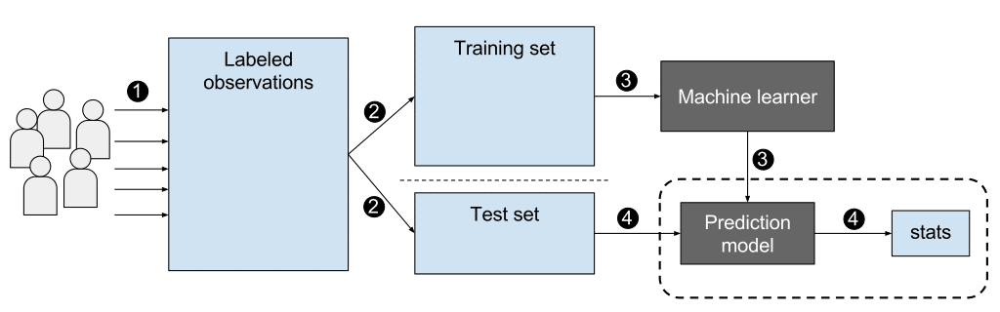

# Machine Learning

```{r, echo=FALSE, message=FALSE, warning=FALSE}
options(digits=3)
set.seed(1)
library(tidyverse)
library(dslabs)
ds_theme_set()
```

# Introduction

Perhaps the most popular data science methodologies come from the field of _machine learning_. Machine learning success stories include the handwritten zip code readers implemented by the postal service, speech recognition technology such as Apple's Siri, movie recommendation systems, spam and malware detectors, housing price predictors, and driverless cars. Although today Artificial Intelligence and machine learning are often used interchangeably, we make the following distinction: while the first artificial intelligence algorithms, such as those used by chess playing machines, implemented decision making based on programmable rules derived from theory or first principles, in machine learning decisions are based on algorithms **built with data**. 


## Notation

In machine learning, data comes in the form of:

1. the _outcome_ we want to predict and 
2. the _features_ that we will use to predict the outcome

We want to build an algorithm that takes feature values as input and returns a prediction for the outcome when we don't know the outcome. The machine learning approach is to _train_ an algorithm using a dataset for which we do know the outcome, and then apply this algorithm in the future to make a prediction when we don't know the outcome.

Here we will use $Y$ to denote the outcome and $X_1, \dots, X_p$ to denote features. Note that features are sometimes referred to as predictors or covariates. We consider all these to be synonyms.

Prediction problems can be divided into categorical and continuous outcomes. For categorical outcomes, $Y$ can be any one of $K$ classes. The number of classes can vary greatly across applications.
For example, in the digit reader data, $K=10$ with the classes being the digits 0, 1, 2, 3, 4, 5, 6, 7, 8, and 9. In speech recognition, the outcomes are all possible words or phrases we are trying to detect. Spam detection has two outcomes: spam or not spam. In this course, we denote the $K$ categories with indexes $k=1,\dots,K$. However, for binary data we will use $k=0,1$ for mathematical conveniences that we demonstrate later.

The general setup is as follows. We have a series of features and an unknown outcome we want to predict:

```{r, echo=FALSE, message=FALSE, warning=FALSE}
library(tidyverse)
library(knitr)
library(dslabs)
tmp <- tibble(outcome="?", 
              'feature 1' = "$X_1$",
              'feature 2' = "$X_2$",
              'feature 3' = "$X_3$",
              'feature 4' = "$X_4$",
              'feature 5' = "$X_5$")
if(knitr::is_html_output()){
  knitr::kable(tmp, "html", align = "c") %>%
    kableExtra::kable_styling(bootstrap_options = "striped", full_width = FALSE)
} else{
  knitr::kable(tmp, "latex", align="c", escape = FALSE, booktabs = TRUE) %>%
    kableExtra::kable_styling(font_size = 8)
}
```

To _build a model_ that provides a prediction for any set of observed values $X_1=x_1, X_2=x_2, \dots X_5=x_5$, we collect data for which we know the outcome:

```{r, echo=FALSE}
n <- 2
tmp <- tibble(outcome = paste0("$y_{", 1:n,"}$"), 
              'feature 1' = paste0("$x_{",1:n,",1}$"),
              'feature 2' = paste0("$x_{",1:n,",2}$"),
              'feature 3' = paste0("$x_{",1:n,",3}$"),
              'feature 4' = paste0("$x_{",1:n,",4}$"),
              'feature 5' = paste0("$x_{",1:n,",5}$"))
tmp_2 <- rbind(c("$\\vdots$", "$\\vdots$", "$\\vdots$", "$\\vdots$", "$\\vdots$", "$\\vdots$"),
               c("$y_n$", "$x_{n,1}$","$x_{n,2}$","$x_{n,3}$","$x_{n,4}$","$x_{n,5}$"))
colnames(tmp_2) <- names(tmp)
tmp <- bind_rows(tmp, as_tibble(tmp_2))
if(knitr::is_html_output()){
  knitr::kable(tmp, "html") %>%
    kableExtra::kable_styling(bootstrap_options = "striped", full_width = FALSE)
} else{
  knitr::kable(tmp, "latex", escape = FALSE, booktabs = TRUE) %>%
    kableExtra::kable_styling(font_size = 8)
}
```

When the output is continuous we refer to the machine learning task as _prediction_, and the main output of the model is a function $f$ that automatically produces a prediction, denoted with $\hat{y}$, for any set of predictors: $\hat{y} = f(x_1, x_2, \dots, x_p)$.  We use the term _actual outcome_ to denote what we ended up observing. So we want the prediction $\hat{y}$ to match the actual outcome $y$ as well as possible. Because our outcome is continuous, our predictions $\hat{y}$ will not be either exactly right or wrong, but instead we will determine an _error_ defined as the difference between the prediction and the actual outcome $y - \hat{y}$.

When the outcome is categorical, we refer to the machine learning task as _classification_, and the main output of the model will be a _decision rule_ which prescribes which of the $K$ classes we should predict. In this scenario, most models provide functions of the predictors for each class $k$, $f_k(x_1, x_2, \dots, x_p)$, that are used to make this decision. When the data is binary a typical decision rules looks like this: if $f_1(x_1, x_2, \dots, x_p) > C$, predict category 1, if not the other category, with $C$ a predetermined cutoff. Because the outcomes are categorical, our predictions will be either right or wrong. 

Notice that these terms vary among courses, text books, and other publications. Often _prediction_ is used for both categorical and continuous outcomes, and the term _regression_ can be used for the continuous case. Here we avoid using _regression_ to avoid confusion with our previous use of the term _linear regression_. In most cases it will be clear if our outcomes are categorical or continuous, so we will avoid using these terms when possible. 





# Case Study 1: Digit reader 

Let's consider an example. The first thing that happens to a letter when they are received in the post office is that they are sorted by zip code:

```{r, echo=FALSE}
knitr::include_graphics("https://d79i1fxsrar4t.cloudfront.net/assets/img/docs/zip-code-digits.47d1a727.png")
```

Originally humans had to sort these by hand. To do this they had to read the zip codes on each letter. Today thanks to machine learning algorithms, a computer can read zip codes and then a robot sorts the letters. In this lecture we will learn how to build algorithms that can read a digit.

The first step in building an algorithm is to understand what the outcomes and features are. Below are three images of written digits. These have already been read by a human and assigned an outcome $y$. These are considered known and serve as the **training set**. 

```{r, echo=FALSE, cache=TRUE, message=FALSE}
url <- "https://raw.githubusercontent.com/datasciencelabs/data/master/hand-written-digits-train.csv"
digits <- read_csv(url)
tmp <- lapply( c(1,4,5), function(i){
    expand.grid(Row=1:28, Column=1:28) %>%  
      mutate(id=i, label=digits$label[i],  
             value = unlist(digits[i,-1])) 
})
tmp <- Reduce(rbind, tmp)
tmp %>% ggplot(aes(Row, Column, fill=value)) + 
    geom_raster() + 
    scale_y_reverse() +
    scale_fill_gradient(low="white", high="black") +
    facet_grid(.~label)
```

The images are converted into $28 \times 28 = 784$ pixels and for each pixel we obtain a grey scale intensity between 0 (white) and 255 (black) which we consider continuous for now. We can see these values like this:

```{r, echo=FALSE}
tmp %>% ggplot(aes(Row, Column, fill=value)) + 
    geom_point(pch=21) + 
    scale_y_reverse() +
    scale_fill_gradient(low="white", high="black") +
    facet_grid(.~label)
```

For each digit $i$ we have a categorical outcome $Y_i$ which can be one of 10 values: $0,1,2,3,4,5,6,7,8,9$ and features $X_{i,1}, \dots, X_{i,784}$. We use bold face $\mathbf{X}_i = (X_{i,1}, \dots, X_{i,784})$ to distinguish the vector from the individual predictors. When referring to an arbitrary set of features we drop the index $i$ and use $Y$ and $\mathbf{X} = (X_{1}, \dots, X_{784})$. We use upper case variables because, in general, we think of the predictors as random variables. We use lower case, for example $\mathbf{X} = \mathbf{x}$, to denote observed values. 

The machine learning task is to build an algorithm that returns a prediction for any of the possible values of the features. Here we will learn several approaches to building these algorithms. Although at this point it might seem impossible to achieve this, we will start with a simpler example, and build up our knowledge until we can attack this more complex example.

## Evaluation metrics

Before we start describing approaches to optimize the way we build algorithms, we first need to define what we mean when we say one approach is better than another. In this section, we focus on describing ways in which machine learning algorithms are evaluated. Specifically, we need to quantify what we mean by "better".

For our first introduction to machine learning concepts, we will start with a boring and simple example: how to predict sex using height. As we explain machine learning step by step, this example will let us set down the first building block. Soon enough, we will be attacking more interesting challenges. We use the __caret__ package, which has several useful functions for building and assessing machine learning methods and we introduce in more detail in a future lecture.

```{r, message=FALSE, warning=FALSE}
library(tidyverse)
library(caret)
```

For a first example, we use the height data in dslabs:

```{r}
library(dslabs)
data(heights)
```

We start by defining the outcome and predictors. 

```{r}
y <- heights$sex
x <- heights$height
```

In this case, we have only one predictor, height, and `y` is clearly a categorical outcome since observed values are either `Male` or `Female`.
We know that we will not be able to predict $Y$ very accurately based on $X$ because male and female average heights are not that different relative to within group variability. But can we do better than guessing? To answer this question, we need a quantitative definition of better. 

### Training and test sets

Ultimately, a machine learning algorithm is evaluated on how it performs in the real world with completely new datasets. However, when developing an algorithm, we usually have a dataset for which we know the outcomes, as we do with the heights: we know the sex of every student in our dataset. Therefore, to mimic the ultimate evaluation process, we typically split the data into two parts and act as if we don't know the outcome for one of these. We stop pretending we don't know the outcome to evaluate the algorithm, but only *after* we are done constructing it. We refer to the group for which we know the outcome, and use to develop the algorithm, as the _training_ set. We refer to the group for which we pretend we don't know the outcome as the _test_ set. 

A standard way of generating the training and test sets is by randomly splitting the data. The __caret__ package includes the function `createDataPartition` that helps us generates indexes for randomly splitting the data into training and test sets: 


```{r}
set.seed(2007)
test_index <- createDataPartition(y, times = 1, p = 0.5, list = FALSE)
```

The argument `times` is used to define how many random samples of indexes to return, the argument `p` is used to define what proportion of the data is represented by the index, and the argument `list` is used to decide if we want the indexes returned as a list or not.
We can use the result of the `createDataPartition` function call to define the training and test sets like this:

```{r}
test_set <- heights[test_index, ]
train_set <- heights[-test_index, ]
```

We will now develop an algorithm using **only** the training set. Once we are done developing the algorithm, we will _freeze_ it and evaluate it using the test set. The simplest way to evaluate the algorithm when the outcomes are categorical is by simply reporting the proportion of cases that were correctly predicted **in the test set**. This metric is usually referred to as _overall accuracy_.

### Overall accuracy

To demonstrate the use of overall accuracy, we will build two competing algorithms and compare them.

Let's start by developing the simplest possible machine algorithm: guessing the outcome.

```{r}
y_hat <- sample(c("Male", "Female"), length(test_index), replace = TRUE)
```

Note that we are completely ignoring the predictor and simply guessing the sex. 

In machine learning applications, it is useful to use factors to represent the categorical outcomes because R functions developed for machine learning, such as those in the __caret__ package, require or recommend that categorical outcomes be coded as factors. So convert `y_hat` to factors using the `factor` function:

```{r}
y_hat <- sample(c("Male", "Female"), length(test_index), replace = TRUE) %>%
  factor(levels = levels(test_set$sex))
```

The _overall accuracy_ is simply defined as the overall proportion that is predicted correctly:

```{r}
mean(y_hat == test_set$sex)
```

Not surprisingly, our accuracy is about 50%. We are guessing!

Can we do better? Exploratory data analysis suggests we can because, on average, males are slightly taller than females:

```{r}
heights %>% group_by(sex) %>%
  summarize(mean(height), sd(height))
```

But how do we make use of this insight? Let's try another simple approach: predict `Male` if height is within two standard deviations from the average male:

```{r}
y_hat <- ifelse(x > 62, "Male", "Female") %>% 
  factor(levels = levels(test_set$sex))
```

The accuracy goes up from 0.50 to about 0.80:

```{r}
mean(y == y_hat)
```

But can we do even better? In the example above, we used a cutoff of 62, but we can examine the accuracy obtained for other cutoffs and then pick the value that provides the best results. But remember, **it is important that we optimize the cutoff using only the training set**: the test set is only for evaluation. Although for this simplistic example it is not much of a problem, later we will learn that evaluating an algorithm on the training set can lead to _overfitting_, which often results in dangerously over-optimistic assessments. 

Here we examine the accuracy of 10 different cutoffs and pick the one yielding the best result:

```{r}
cutoff <- seq(61, 70)
accuracy <- map_dbl(cutoff, function(x){
  y_hat <- ifelse(train_set$height > x, "Male", "Female") %>% 
    factor(levels = levels(test_set$sex))
  mean(y_hat == train_set$sex)
})
```

We can make a plot showing the accuracy obtained on the training set for males and females:

```{r accuracy-vs-cutoff, echo=FALSE}
data.frame(cutoff, accuracy) %>% 
  ggplot(aes(cutoff, accuracy)) + 
  geom_point() + 
  geom_line() 
```

We see that the maximum value is:

```{r}
max(accuracy)
```

which is much higher than 0.5. The cutoff resulting in this accuracy is:

```{r}
best_cutoff <- cutoff[which.max(accuracy)]
best_cutoff
```

We can now test this cutoff on our test set to make sure our accuracy is not overly optimistic:

```{r}
y_hat <- ifelse(test_set$height > best_cutoff, "Male", "Female") %>% 
  factor(levels = levels(test_set$sex))
y_hat <- factor(y_hat)
mean(y_hat == test_set$sex)
```

We see that it is a bit lower than the accuracy observed for the training set, but it is still better than guessing. And by testing on a dataset that we did not train on, we know our result is not due to cherry-picking a good result.

### The confusion matrix

The prediction rule we developed in the previous section predicts `Male` if the student is taller than `r best_cutoff` inches. Given that the average female is about `r best_cutoff` inches, this prediction rule seems wrong. What happened? If a student is the height of the average female, shouldn't we predict `Female`? 

Generally speaking, overall accuracy can be a deceptive measure. To see this, we will start by constructing what is referred to as the _confusion matrix_, which basically tabulates each combination of prediction and actual value. We can do this in R using the function `table`:

```{r}
table(predicted = y_hat, actual = test_set$sex)
```

If we study this table closely, it reveals a problem. If we compute the accuracy separately for each sex, we get:

```{r}
test_set %>%
  mutate(y_hat = y_hat) %>%
  group_by(sex) %>% 
  summarize(accuracy = mean(y_hat == sex))
```

There is an imbalance in the accuracy for males and females: too many females are predicted to be male. We are calling almost half of the females male! How can our overall accuracy be so high then?  This is because the _prevalence_ of males in this dataset is high. These heights were collected from three data sciences courses, two of which had more males enrolled:


```{r}
prev <- mean(y == "Male")
prev
```

So when computing overall accuracy, the high percentage of mistakes made for females is outweighed by the gains in correct calls for men. **This can actually be a big problem in machine learning.** If your training data is biased in some way, you are likely to develop algorithms that are biased as well. The fact that we used a test set does not matter because it is also derived from the original biased dataset. This is one of the reasons we look at metrics other than overall accuracy when evaluating a machine learning algorithm.

There are several metrics that we can use to evaluate an algorithm in a way that prevalence does not cloud our assessment, and these can all be derived from the confusion matrix. A general improvement to using overall accuracy is to study _sensitivity_ and _specificity_ separately. 

### Sensitivity and specificity 

To define sensitivity and specificity, we need a binary outcome. When the outcomes are categorical, we can define these terms for a specific category. In the digits example, we can ask for the specificity in the case of correctly predicting 2 as opposed to some other digit. Once we specify a category of interest, then we can talk about positive outcomes, $Y=1$, and negative outcomes, $Y=0$.

In general, _sensitivity_ is defined as the ability of an algorithm to predict a positive outcome when the actual outcome is positive: $\hat{Y}=1$ when $Y=1$. Because an algorithm that calls everything positive ($\hat{Y}=1$ no matter what) has perfect sensitivity, this metric on its own is not enough to judge an algorithm. For this reason, we also examine _specificity_, which is generally defined as the ability of an algorithm to not predict a positive $\hat{Y}=0$ when the actual outcome is not a positive $Y=0$. We can summarize in the following way:

* High sensitivity: $Y=1 \implies \hat{Y}=1$
* High specificity: $Y=0 \implies \hat{Y} = 0$

Although the above is often considered the definition of specificity, another way to think of specificity is by the proportion of positive calls that are actually positive:

* High specificity:  $\hat{Y}=1 \implies Y=1$.

To provide precise definitions, we name the four entries of the confusion matrix:

```{r, echo=FALSE}
mat <- matrix(c("True positives (TP)", "False negatives (FN)", 
                "False positives (FP)", "True negatives (TN)"), 2, 2)
colnames(mat) <- c("Actually Positive", "Actually Negative")
rownames(mat) <- c("Predicted positive", "Predicted negative")
tmp <- as.data.frame(mat)
if(knitr::is_html_output()){
  knitr::kable(tmp, "html") %>%
    kableExtra::kable_styling(bootstrap_options = "striped", full_width = FALSE)
} else{
  knitr::kable(tmp, "latex", booktabs = TRUE) %>%
    kableExtra::kable_styling(font_size = 8)
}
```

Sensitivity is typically quantified by $TP/(TP+FN)$, the proportion of actual positives (the first column = $TP+FN$) that are called positives ($TP$). This quantity is referred to as the _true positive rate_ (TPR) or _recall_. 

Specificity is defined as $TN/(TN+FP)$ or the proportion of negatives (the second column = $FP+TN$) that are called negatives ($TN$). This quantity is also called the true negative rate (TNR). There is another way of quantifying specificity which is $TP/(TP+FP)$ or the proportion of outcomes called positives (the first row or $TP+FP$) that are actually positives ($TP$). This quantity is referred to as _positive predictive value (PPV)_  and also as _precision_. Note that, unlike TPR and TNR, precision depends on prevalence since higher prevalence implies you can get higher precision even when guessing. 

The multiple names can be confusing, so we include a table to help us remember the terms. The table includes a column that shows the definition if we think of the proportions as probabilities.


| Measure of | Name 1 | Name 2 | Definition | Probability representation |
|---------|-----|----------|--------|------------------|
sensitivity | TPR | Recall | $\frac{\mbox{TP}}{\mbox{TP} + \mbox{FN}}$ | $\mbox{Pr}(\hat{Y}=1 \mid Y=1)$ |
specificity | TNR | 1-FPR | $\frac{\mbox{TN}}{\mbox{TN}+\mbox{FP}}$ | $\mbox{Pr}(\hat{Y}=0 \mid Y=0)$ |
specificity |  PPV | Precision | $\frac{\mbox{TP}}{\mbox{TP}+\mbox{FP}}$ | $\mbox{Pr}(Y=1 \mid \hat{Y}=1)$|

Here TPR is True Positive Rate, FPR is False Positive Rate, and PPV is Positive Predictive Value.
The __caret__ function `confusionMatrix` computes all these metrics for us once we define what category "positive" is. The function expects factors as input, and the first level is considered the positive outcome or $Y=1$. In our example, `Female` is the first level because it comes before `Male` alphabetically. If you type this into R you will see several metrics including accuracy, sensitivity, specificity, and PPV.

```{r}
cm <- confusionMatrix(data = y_hat, reference = test_set$sex)
```

You can acceess these directly, for example, like this:

```{r}
cm$overall["Accuracy"]
cm$byClass[c("Sensitivity","Specificity", "Prevalence")]
```

We can see that the high overall accuracy is possible despite relatively low sensitivity. As we hinted at above, the reason this happens is because of the low prevalence (0.23): the proportion of females is low. Because prevalence is low, failing to predict actual females as females (low sensitivity) does not lower the accuracy as much as failing to predict actual males as males (low specificity). This is an example of why it is important to examine sensitivity and specificity and not just accuracy. Before applying this algorithm to general datasets, we need to ask ourselves if prevalence will be the same.


### Balanced accuracy and $F_1$ score

Although we usually recommend studying both specificity and sensitivity, very often it is useful to have a one-number summary, for example for optimization purposes. One metric that is preferred over overall accuracy is the average of specificity and sensitivity, referred to as _balanced accuracy_. Because specificity and sensitivity are rates, it is more appropriate to compute the _harmonic_ average. In fact, the _$F_1$-score_, a widely used one-number summary, is the harmonic average of precision and recall:

$$
\frac{1}{\frac{1}{2}\left(\frac{1}{\mbox{recall}} + 
    \frac{1}{\mbox{precision}}\right) }
$$

Because it is easier to write, you often see this harmonic average rewritten as:

$$
2 \times \frac{\mbox{precision} \cdot \mbox{recall}}
{\mbox{precision} + \mbox{recall}}
$$

when defining $F_1$. 

Remember that, depending on the context, some types of errors are more costly than others. For example, in the case of plane safety, it is much more important to maximize sensitivity over specificity: failing to predict a plane will malfunction before it crashes is a much more costly error than grounding a plane when, in fact, the plane is in perfect condition. In a capital murder criminal case, the opposite is true since a false positive can lead to executing an innocent person. The $F_1$-score can be adapted to weigh specificity and sensitivity differently. To do this, we define $\beta$ to represent how much more important sensitivity is compared to specificity and consider a weighted harmonic average:

$$
\frac{1}{\frac{\beta^2}{1+\beta^2}\frac{1}{\mbox{recall}} + 
    \frac{1}{1+\beta^2}\frac{1}{\mbox{precision}} }
$$


The `F_meas` function in the __caret__ package computes this summary with `beta` defaulting to 1.


Let's rebuild our prediction algorithm, but this time maximizing the F-score instead of overall accuracy:

```{r}
cutoff <- seq(61, 70)
F_1 <- map_dbl(cutoff, function(x){
  y_hat <- ifelse(train_set$height > x, "Male", "Female") %>% 
    factor(levels = levels(test_set$sex))
  F_meas(data = y_hat, reference = factor(train_set$sex))
})
```

As before, we can plot these $F_1$ measures versus the cutoffs:

```{r f_1-vs-cutoff, echo=FALSE}
data.frame(cutoff, F_1) %>% 
  ggplot(aes(cutoff, F_1)) + 
  geom_point() + 
  geom_line() 
```

We see that it is maximized at $F_1$ value of:

```{r}
max(F_1)
```

This maximum is achieved when we use the following cutoff:
```{r}
best_cutoff <- cutoff[which.max(F_1)]
best_cutoff
```

A cutoff of `r best_cutoff` makes more sense than 64. Furthermore, it balances the specificity and sensitivity of our confusion matrix:

```{r}
y_hat <- ifelse(test_set$height > best_cutoff, "Male", "Female") %>% 
  factor(levels = levels(test_set$sex))
sensitivity(data = y_hat, reference = test_set$sex)
specificity(data = y_hat, reference = test_set$sex)
```

We now see that we do much better than guessing, that both sensitivity and specificity are relatively high, and that we have built our first machine learning algorithm. It takes height as a predictor and predicts female if you are 65 inches or shorter. 


### Prevalence matters in practice

A machine learning algorithm with very high sensitivity and specificity may not be useful in practice when prevalence is close to either 0 or 1. To see this, consider the case of a doctor that specializes in a rare disease and is interested in developing an algorithm for predicting who has the disease. The doctor shares data with you and you then develop an algorithm with very high sensitivity. You explain that this means that if a patient has the disease, the algorithm is very likely to predict correctly. You also tell the doctor that you are also concerned because, based on the dataset you analyzed, 1/2 the patients have the disease: $\mbox{Pr}(\hat{Y}=1)$. The doctor is neither concerned nor impressed and explains that what is important is the precision of the test: $\mbox{Pr}(Y=1 | \hat{Y}=1)$. Using Bayes theorem, we can connect the two measures:

$$ \mbox{Pr}(Y = 1\mid \hat{Y}=1) = \mbox{Pr}(\hat{Y}=1 \mid Y=1) \frac{\mbox{Pr}(Y=1)}{\mbox{Pr}(\hat{Y}=1)}$$

The doctor knows that the prevalence of the disease is 5 in 1,000, which implies that $\mbox{Pr}(Y=1) \, / \,\mbox{Pr}(\hat{Y}=1) = 1/100$ and therefore the precision of your algorithm is less than 0.01. The doctor does not have much use for your algorithm.


### ROC and precision-recall curves

When comparing the two methods (guessing versus using a height cutoff), we looked at accuracy and $F_1$. The second method clearly outperformed the first.  However, while we considered several cutoffs for the second method, for the first we only considered one approach: guessing with equal probability. Note that guessing `Male` with higher probability would give us higher accuracy due to the bias in the sample:


```{r}
p <- 0.9
n <- length(test_index)
y_hat <- sample(c("Male", "Female"), n, replace = TRUE, prob=c(p, 1-p)) %>% 
  factor(levels = levels(test_set$sex))
mean(y_hat == test_set$sex)
```

But, as described above, this would come at the cost of lower sensitivity. The curves we describe in this section will help us see this.

Remember that for each of these parameters, we can get a different sensitivity and specificity. For this reason, a very common approach to evaluating methods is to compare them graphically by plotting both.

A widely used plot that does this is the _receiver operating characteristic_ (ROC) curve. If you are wondering where this name comes from, you can consult the 
ROC Wikipedia page^[https://en.wikipedia.org/wiki/Receiver_operating_characteristic].

The ROC curve plots sensitivity (TPR) versus 1 - specificity or the false positive rate (FPR). Here we compute the TPR and FPR needed for different probabilities of guessing male:

```{r roc-1}
probs <- seq(0, 1, length.out = 10)
guessing <- map_df(probs, function(p){
  y_hat <- 
    sample(c("Male", "Female"), n, replace = TRUE, prob=c(p, 1-p)) %>% 
    factor(levels = c("Female", "Male"))
  list(method = "Guessing",
       FPR = 1 - specificity(y_hat, test_set$sex),
       TPR = sensitivity(y_hat, test_set$sex))
})
```

We can use similar code to compute these values for our our second approach. By plotting both curves together, we are able to compare sensitivity for different values of specificity:


```{r, echo=FALSE}
cutoffs <- c(50, seq(60, 75), 80)
height_cutoff <- map_df(cutoffs, function(x){
  y_hat <- ifelse(test_set$height > x, "Male", "Female") %>% 
    factor(levels = c("Female", "Male"))
   list(method = "Height cutoff",
        FPR = 1-specificity(y_hat, test_set$sex),
        TPR = sensitivity(y_hat, test_set$sex))
})
```


```{r roc-3, echo=FALSE, fig.width=6, fig.height=3}
library(ggrepel)
tmp_1 <- map_df(cutoffs, function(x){
  y_hat <- ifelse(test_set$height > x, "Male", "Female") %>% 
    factor(levels = c("Female", "Male"))
   list(method = "Height cutoff",
        cutoff = x, 
        FPR = 1-specificity(y_hat, test_set$sex),
        TPR = sensitivity(y_hat, test_set$sex))
}) 
tmp_2 <- map_df(probs, function(p){
  y_hat <- 
    sample(c("Male", "Female"), n, replace = TRUE, prob=c(p, 1-p)) %>% 
    factor(levels = c("Female", "Male"))
  list(method = "Guessing",
       cutoff = round(p,1),
       FPR = 1 - specificity(y_hat, test_set$sex),
       TPR = sensitivity(y_hat, test_set$sex))
})
bind_rows(tmp_1, tmp_2) %>%
  ggplot(aes(FPR, TPR, label = cutoff, color = method)) +
  geom_line() +
  geom_point() +
  geom_text_repel(nudge_x = 0.01, nudge_y = -0.01, show.legend = FALSE)
```

We can see that we obtain higher sensitivity with this approach for all values of specificity, which implies it is in fact a better method. Note that ROC curves for guessing always fall on the identiy line. Also note that when making ROC curves, it is often nice to add the cutoff associated with each point.

The packages __pROC__ and __plotROC__ are useful for generating these plots.

ROC curves have one weakness and it is that neither of the measures plotted depends on prevalence. In cases in which prevalence matters, we may instead make a precision-recall plot. The idea is similar, but we instead plot precision against recall:


```{r precision-recall-1, warning=FALSE, message=FALSE, echo=FALSE}
guessing <- map_df(probs, function(p){
  y_hat <- sample(c("Male", "Female"), length(test_index), 
                  replace = TRUE, prob=c(p, 1-p)) %>% 
    factor(levels = c("Female", "Male"))
  list(method = "Guess",
    recall = sensitivity(y_hat, test_set$sex),
    precision = precision(y_hat, test_set$sex))
})
height_cutoff <- map_df(cutoffs, function(x){
  y_hat <- ifelse(test_set$height > x, "Male", "Female") %>% 
    factor(levels = c("Female", "Male"))
  list(method = "Height cutoff",
       recall = sensitivity(y_hat, test_set$sex),
    precision = precision(y_hat, test_set$sex))
})
tmp_1 <- bind_rows(guessing, height_cutoff) %>% mutate(Positive = "Y = 1 if Female") 
guessing <- map_df(probs, function(p){
  y_hat <- sample(c("Male", "Female"), length(test_index), replace = TRUE, 
                  prob=c(p, 1-p)) %>% 
    factor(levels = c("Male", "Female"))
  list(method = "Guess",
    recall = sensitivity(y_hat, relevel(test_set$sex, "Male", "Female")),
    precision = precision(y_hat, relevel(test_set$sex, "Male", "Female")))
})
height_cutoff <- map_df(cutoffs, function(x){
  y_hat <- ifelse(test_set$height > x, "Male", "Female") %>% 
    factor(levels = c("Male", "Female"))
  list(method = "Height cutoff",
       recall = sensitivity(y_hat, relevel(test_set$sex, "Male", "Female")),
    precision = precision(y_hat, relevel(test_set$sex, "Male", "Female")))
})
tmp_2 <- bind_rows(guessing, height_cutoff) %>% mutate(Positive = "Y = 1 if Male") 
bind_rows(tmp_1, tmp_2) %>%
  ggplot(aes(recall, precision, color = method)) +
  geom_line() +
  geom_point() +
  facet_wrap(~ Positive)
```

From this plot we immediately see that the precision of guessing is not high. This is because the prevalence is low. We also see that if we change positives to mean Male instead of Female, the ROC curve remains the same, but the precision recall plot changes.


### The loss function

Up to now we have described evaluation metrics that apply exclusively to categorical data. 
Specifically, for binary outcomes, we have described how sensitivity, specificity, accuracy, and $F_1$ can be used as quantification. However, these metrics are not useful for continuous outcomes. In this section, we describe how the general approach to defining "best" in machine learning is to define a _loss function_, which can be applied to both categorical and continuous data. 

The most commonly used loss function is the squared loss function. If $\hat{y}$ is our predictor and $y$ is the observed outcome, the squared loss function is simply:

$$
(\hat{y} - y)^2
$$

Because we often have a test set with many observations, say $N$, we use the mean squared error (MSE):

$$
\mbox{MSE} = \frac{1}{N} \mbox{RSS} = \frac{1}{N}\sum_{i=1}^N (\hat{y}_i - y_i)^2
$$

In practice, we often report the root mean squared error (RMSE), which is $\sqrt{\mbox{MSE}}$, because it is in the same units as the outcomes. But doing the math is often easier with the MSE and it is therefore more commonly used in textbooks, since these usually describe theoretical properties of algorithms.

If the outcomes are binary, both RMSE and MSE are equivalent to one minus accuracy, since $(\hat{y} - y)^2$ is 0 if the prediction was correct and 1 otherwise. In general, our goal is to build an algorithm that minimizes the loss so it is as close to 0 as possible.

Because our data is usually a random sample, we can think of the MSE as a random variable and the observed MSE can be thought of as an estimate of the expected MSE, which in mathematical notation we write like this:

$$
\mbox{E}\left\{ \frac{1}{N}\sum_{i=1}^N (\hat{Y}_i - Y_i)^2 \right\}
$$

This is a theoretical concept because in practice we only have one dataset to work with. But in theory, we think of having a very large number of random samples (call it $B$), apply our algorithm to each, obtain an MSE for each random sample, and think of the expected MSE as:

$$
\frac{1}{B} \sum_{b=1}^B \frac{1}{N}\sum_{i=1}^N \left(\hat{y}_i^b - y_i^b\right)^2 
$$

with $y_{i}^b$ denoting the $i$th observation in the $b$th random sample and $\hat{y}_i^b$ the resulting prediction obtained from applying the exact same algorithm to the $b$th random sample. Again, in practice we only observe one random sample, so the expected MSE is only theoretical. However, in a future lecture we describe an approach to estimating the MSE that tries to mimic this theoretical quantity.

Note that there are loss functions other than the squared loss. For example, the _Mean Absolute Error_ uses absolute values, $|\hat{Y}_i - Y_i|$ instead of squaring the errors $(\hat{Y}_i - Y_i)^2$. However, in this class we focus on minimizing square loss since it is the most widely used.


## Case Study 2: Melanoma 

Here we consider a prediction task based on the `melanoma` data from the `boot` package, which records tumor thickness (mm) and survival status after tumor removal for 205 patients with malignant melanoma. For this two-class problem, we will focus only on patients who either died from melanoma (`1`) or were still alive at the end of the study (`2`), and drop who died of other causes. 

```{r, message=FALSE}
library(boot)
data(melanoma)
melanoma = melanoma %>% subset(status %in% c(1, 2)) %>% 
  mutate(status = as.factor(ifelse(status == 1, "Dead", "Alive")))
```

We want to predict patient status based on tumor thickness. We start by defining the outcome and predictor. In this example we have only one predictor.

```{r}
y <- melanoma$status
x <- melanoma$thickness
```

This is clearly a categorical outcome since $Y$ can be `Dead` or `Alive`. We can code a random guess like this:

```{r}
set.seed(1)
N <- length(y)
y_hat <- sample(c("Dead", "Alive"), N, replace = TRUE)
```

First, we will quantify what it means to do better. The confusion matrix breaks down the correct and incorrect classifications:

```{r}
table(predicted = y_hat, actual = y)
```

The _accuracy_ is simply defined as the overall proportion that is predicted correctly:

```{r}
mean(y_hat == y)
```

Not surprisingly, by guessing, our accuracy is about 50%. No matter the actual status, we guess dead half the time. Can we do better? We know those who died had tumors that were slightly thicker, 

```{r}
melanoma %>% group_by(status) %>% summarize(mean(thickness), sd(thickness))
```

so let's try to use our covariate. 

### Training and test sets

Let's first define and separate our training and test sets. 

```{r, message=FALSE}
library(caret)
set.seed(10)
train_index <- createDataPartition(y, times = 1, p = 0.5, list = FALSE)
head(train_index)
```

We can use this index to define the training and test sets:

```{r}
train_set <- melanoma[train_index, ]
test_set <- melanoma[-train_index, ]
head(train_set)
head(test_set)
```

Now let's use the train set to examine the accuracy of 12 different cutoffs:

```{r}
cutoff <- seq(0.5, 6, by = 0.5)
accuracy <- map_dbl(cutoff, function(x){
  y_hat <- ifelse(train_set$thickness >= x, "Dead", "Alive")
  mean(y_hat == train_set$status)
})
```

We can make a plot showing the accuracy on the training set for those who lived and those who died.

```{r accuracy-v-cutoff, echo=FALSE}
data.frame(cutoff, accuracy) %>% 
  ggplot(aes(cutoff, accuracy)) + 
  geom_point() + 
  geom_line() 
```

We see that the maximum value is:

```{r}
max(accuracy)
```

much higher than 0.5, and it is maximized with the cutoff:

```{r}
best_cutoff <- cutoff[which.max(accuracy)]
best_cutoff
```

Now we can test this cutoff on our test set to make sure our accuracy is not overly optimistic:

```{r}
y_hat <- ifelse(test_set$thickness >= best_cutoff, "Dead", "Alive")
mean(y_hat == test_set$status)
```

We see that it is lower than the accuracy observed for the training set, but it is still better than guessing. And by testing on a dataset that we did not train on, we know we did not cheat.

### Prevalence, Sensitivity and Specificity

We look at the proportion of calls for each status type:

```{r, message=FALSE, warning=FALSE}
test_set %>% 
  mutate(y_hat = y_hat) %>%
  group_by(status) %>% 
  summarize(accuracy = mean(y_hat == status))
```

There is an imbalance in the accuracy for those who died and those who survived: too many of those who died are predicted to have survived. The reason this does not affect our overall accuracy is because the _prevalence_ of death in this dataset is low:

```{r}
prev <- mean(y == "Dead")
prev
```

So the high percentage of mistakes made for those who died is outweighed by the gains in correct calls for those who survived. This can be a big problem in machine learning. **If your training data is biased in some way, you are likely to develop algorithms that are biased as well. This is one of the reasons we look at metrics other than overall accuracy when evaluating a machine learning algorithm**.


To evaluate an algorithm in a way that prevalence does not cloud our assessment, we can study _sensitivity_ and _specificity_ separately. 

The caret function `confusionMatrix` computes all these metrics for us once we define what a positive is. The function expects factors as input and coerces characters into factors. The first level is considered the positives. By default, `Alive` is the first level because it comes before `Dead` alphabetically, but we can set `Dead` to be the positive class by passing it into the `positive` argument. 


```{r}
library(e1071)
confusionMatrix(data = as.factor(y_hat), 
                reference = test_set$status, positive = "Dead")
```

We can see that the high accuracy is possible despite relatively low sensitivity.  The reason this can happen is the low prevalence: because the proportion of dead patients is low, incorrectly classifying them as having survived does not lower the accuracy as much as it is increased by most survivors being predicted as survivors. This is an example of why it’s important to examine sensitivity and specificity and not just overall accuracy.

If we want one summary performance metric, we can reassess our algorithm above using the F-score instead:

```{r}
cutoff <- seq(0.5, 6, by = 0.5)
F_1 <- map_dbl(cutoff, function(x){
  y_hat <- ifelse(train_set$thickness > x, "Dead", "Alive")
  F_meas(data = as.factor(y_hat), reference = train_set$status)
})
```

As before, we can plot these $F_1$ measures versus the cutoffs:

```{r, echo=FALSE}
data.frame(cutoff, F_1) %>% 
  ggplot(aes(cutoff, F_1)) + 
  geom_point() + 
  geom_line() 
```

We see that it is maximized at:

```{r}
max(F_1)
```

when we use cutoff:
```{r}
best_cutoff <- cutoff[which.max(F_1)]
best_cutoff
```


## Conditional probabilities

In machine learning applications, we rarely can predict outcomes perfectly. For example, spam detectors often miss emails that are clearly spam, Siri often misunderstands the words we are saying, and your bank at times thinks your card was stolen when it was not. The most common reason for not being able to build perfect algorithms is that it is impossible. To see this, note that most datasets will include groups of observations with the same exact observed values for all predictors, but with different outcomes. Because our prediction rules are functions, equal inputs (the predictors) implies equal outputs (the predictions). Therefore, for a challenge in which the same predictors are associated with different outcomes across different individual observations, it is impossible to predict correctly for all these cases. We saw a simple example of this in the previous section: for any given height $x$, you will have both males and females that are $x$ inches tall.

However, none of this means that we can't build useful algorithms that are much better than guessing, and in some cases better than expert opinions. Observations with the same observed values for the predictors may not all be the same, but we can assume that they all have the same probability of this class or that class. We will write this idea out mathematically for the case of categorical data. 

We use the notation $(X_1 = x_1,\dots,X_p=x_p)$ to represent the fact that we have observed values $x_1,\dots,x_p$ for covariates $X_1, \dots, X_p$. This does not imply that the outcome $Y$ will take a specific value. Instead, it implies a specific probability. In particular, we denote the _conditional probabilities_ for each class $k$:

$$
\mbox{Pr}(Y=k \mid X_1 = x_1,\dots,X_p=x_p), \, \mbox{for}\,k=1,\dots,K
$$

To avoid writing out all the predictors, we will use the bold letters like this: $\mathbf{X} \equiv (X_1,\dots,X_p)$ and $\mathbf{x} \equiv (x_1,\dots,x_p)$. We will also use the following notation for the conditional probability of being class $k$:

$$
p_k(\mathbf{x}) = \mbox{Pr}(Y=k \mid \mathbf{X}=\mathbf{x}), \, \mbox{for}\, k=1,\dots,K
$$

Note: We will be using the $p(x)$ notation to represent conditional probabilities as functions of the predictors. Do not confuse it with the $p$ that represents the number of predictors.

These probabilities guide the construction of an algorithm that makes the best prediction: for any given $\mathbf{x}$, we will predict the class $k$ with the largest probability among $p_1(x), p_2(x), \dots p_K(x)$. In mathematical notation, we write it like this: $\hat{Y} = \max_k p_k(\mathbf{x})$.

In machine learning, we refer to this as _Bayes' Rule_. But keep in mind that this is a theoretical rule since in practice we don't know $p_k(\mathbf{x}), k=1,\dots,K$. In fact, estimating these conditional probabilities can be thought of as the main challenge of machine learning. The better our probability estimates $\hat{p}_k(\mathbf{x})$, the better our predictor: 

$$\hat{Y} = \max_k \hat{p}_k(\mathbf{x})$$

So what we will predict depends on two things: 1) how close are the $\max_k p_k(\mathbf{x})$ to 1 or 0 (perfect certainty)
and 2) how close our estimates $\hat{p}_k(\mathbf{x})$ are to $p_k(\mathbf{x})$. We can't do anything about the first restriction as it is determined by the nature of the problem, so our energy goes into finding ways to best estimate conditional probabilities. The first restriction does imply that we have limits as to how well even the best possible algorithm can perform. You should get used to the idea that while in some challenges we will be able to achieve almost perfect accuracy, with digit readers for example, in others our success is restricted by the randomness of the process, with movie recommendations for example. 

Before we continue, it is important to remember that defining our prediction by maximizing the probability is not always optimal in practice and depends on the context. As discussed above, sensitivity and specificity may differ in importance. But even in these cases, having a good estimate of the $p_k(x), k=1,\dots,K$ will suffice for us to build optimal prediction models, since we can control the balance between specificity and sensitivity however we wish. For instance, we can simply change the cutoffs used to predict one outcome or the other. In the plane example, we may ground the plane anytime the probability of malfunction is higher than 1 in a million as opposed to the default 1/2 used when error types are equally undesired. 


To simplify the expression below, let's consider the predicting melanoma survival example which is a binary data case. 

For binary data, you can think of the probability $\mbox{Pr}(Y=1 \mid \mathbf{X}=\mathbf{x})$ as the proportion of 1s in the stratum of the population for which $\mathbf{X}=\mathbf{x}$. 

## Logistic Regression

If we define the outcome $Y$ as 0 for those who are alive and 1 for those who died and $X$ as the tumor thickness, then we are interested in the conditional probability:

$$
p(x) = \mbox{Pr}( Y = 1 \mid X = x)
$$

As an example, let's provide a prediction for a patient whose tumor was 4mm.  What is the conditional probability of dying if you tumor was 4mm? In our dataset we can estimate this by rounding to the nearest mm and computing:

```{r}
melanoma %>% 
  filter(round(thickness)==4) %>%
  summarize(mean(status=="Dead"))
```

Using data exploration let's see what this estimate of our conditional probability looks like for several values of $x$. 

```{r, message=FALSE, warning=FALSE}
melanoma %>% 
  mutate(x = round(thickness)) %>%
  group_by(x) %>%
  summarize(prob = mean(status == "Dead")) %>%
  ggplot(aes(x, prob)) +
  geom_point()
```


This plot suggests that the conditional probability generally increases with $x$
and, at least in some parts, appears to be a linear function of $x$. Let's assume that this is the case for now and use the following model:

$$
p(x) = \mbox{Pr}( Y = 1 | X=x)  = \beta_0 + \beta_1 x
$$

If we can estimate $\beta_0$ and $\beta_1$ we will have an estimate of $p(x)$ which will permit us to build a classification algorithm.
We will use least squares (linear regression).

```{r}
library(broom)
betas <- train_set %>% 
  mutate(y = as.numeric(status == "Dead")) %>% 
  summarize(tidy(lm(y ~ thickness, data = .))) %>%
  .$estimate
```

The model fits the data relatively well:

```{r conditional-prob-is-approx-linear}
melanoma %>% 
  mutate(x = round(thickness)) %>%
  group_by(x) %>%
  summarize(prob = mean(status == "Dead")) %>%
  ggplot(aes(x, prob)) +
  geom_point() +
  geom_abline(intercept = betas[1], slope = betas[2])
```

and we can define an actual prediction rule, for example: define

$$
\hat{p}(x) = \hat{\beta}_0+ \hat{\beta}_1 x
$$

and predict `Dead` if $\hat{p}(x) > 0.5$. Here is the confusion matrix and relevant statistics:

```{r}
p_hat <- betas[1] + betas[2]*test_set$thickness
prediction <- ifelse(p_hat > 0.5, "Dead", "Alive")
confusionMatrix(data = as.factor(prediction), 
                reference = test_set$status, positive = "Dead")
```

As before we see an imbalance of specificity and sensitivity. In this case we can fix this by changing the probability cutoff. 

One problem with this approach is that $\hat{p}(x)$ can be outside the [0,1] range:

```{r}
range(betas[1] + betas[2]*test_set$thickness)
```


An extension of the regression model that permits us to continue using a regression-like approach is to apply transformations that guarantee that $\hat{p}(x)$ will be between 0 and 1. 

In the case of binary data the most common approach is to fit a _logistic regression_ model which makes use of the _logistic_ transformation 

$$ g(p) = \log \frac{p}{1-p}$$

This logistic transformation converts probability to log odds. As discussed in the data visualization lecture, the odds tell us how much more likely something will happen compared to not happening. So $p=0.5$ means the odds are 1 to 1. If $p=0.75$ the odds are 3 to 1. A nice characteristic of this transformation is that it transforms probabilities to be symmetric around 0. Here is a plot of $g(p)$ versus $p$:

```{r p-versus-logistic-of-p, echo=FALSE}
p <- seq(0.01,.99,len=100)
qplot(p, log( p/(1-p) ), geom="line")
```

With _logistic regression_ we model the conditional probability with:

$$ 
g\left\{ \mbox{Pr}(Y = 1 \mid X=x) \right\} = \beta_0 + \beta_1 x
$$

With this model, we can no longer use least squares. Instead we compute the _maximum likelihood estimate_ (MLE). You can learn more about this concept in a [statistical theory text](http://www.amazon.com/Mathematical-Statistics-Analysis-Available-Enhanced/dp/0534399428). 

In R we can fit the logistic regression model with the function `glm`: generalized linear models. This function is more general than logistic regression so we need to specify the model we want through the `family` parameter:

```{r}
glm_fit <- train_set %>% 
  mutate(y = as.numeric(status == "Dead")) %>%
  glm(y ~ thickness, data=., family = "binomial")
```

We can obtain predictions using the predict function:

```{r}
p_hat_logit <- predict(glm_fit, newdata = test_set, type="response")
```

Note that this model fits the data slightly better than the line:

```{r conditional-prob-glm-fit, echo=FALSE, message=FALSE, warning=FALSE }
tmp <- melanoma %>% 
  mutate(x = round(thickness)) %>%
  group_by(x) %>%
  summarize(prob = mean(status == "Dead")) 
logistic_curve <- data.frame(x = seq(min(tmp$x), max(tmp$x))) %>%
  mutate(p_hat = plogis(glm_fit$coef[1] + glm_fit$coef[2]*x))
tmp %>% 
  ggplot(aes(x, prob)) +
  geom_point() +
  geom_line(data = logistic_curve,
             mapping = aes(x, p_hat), lty = 2)
```


Because we have an estimate $\hat{p}(x)$ we can obtain predictions.

```{r}
y_hat_logit <- ifelse(p_hat_logit > 0.5, "Dead", "Alive")
confusionMatrix(data = as.factor(y_hat_logit), 
                reference = test_set$status, positive = "Dead")
```

## Naive Bayes

The best we can do in a Machine Learning problem is when we actually know

$$
p(x) = \mbox{Pr}(Y=1 \mid \mathbf{X}=\mathbf{x}) 
$$

This gives us what we call _Bayes' Rule_. However, in practice we don't know Bayes' Rule, since estimating $p(x)$ is the main challenge.

_Naive Bayes_ is an approach that tries to estimate $p(x)$ using Bayes theorem.

In this particular example we know that the normal distribution works rather well for the tumor thickness $X$ for both classes $y=1$ (dead) and $y=0$ (alive). This implies that we can approximate the conditional distributions $f_{X|Y=1}$ and $f_{X|Y=0}$. These are the tumor thickness distributions for dead and living patients respectively and we can easily estimate all the necessary parameters from the data:

```{r, message=FALSE, warning=FALSE}
params <- train_set %>% 
  group_by(status) %>% 
  summarize(avg = mean(thickness), sd = sd(thickness))
params
```


The prevalence, which we will denote with $\pi = \mbox{Pr}(Y=1)$, can be estimated with 

```{r}
pi <- train_set %>% 
  summarize(pi = mean(status == "Dead")) %>% 
  .$pi
pi
```

Then using Bayes rule we can compute:

$$
p(x) = \mbox{Pr}(Y=1|X=x) = \frac{f_{X|Y=1}(x) \mbox{Pr}(Y=1)}
{ f_{X|Y=0}(x)\mbox{Pr}(Y=0)  + f_{X|Y=1}(x)\mbox{Pr}(Y=1) }
$$


We can use the `naiveBayes` function from the `e1071` package to do these calculations automatically. Here, `naiveBayes` outputs the prediction class automatically with a default cutoff of 0.5 for the probabilities. If instead of class labels, we want the predicted probabilities, we specify `type = "raw"` to the `predict` function. 

```{r}
nb_fit  <- naiveBayes(status ~ thickness, data = train_set)
p_hat_nb <- predict(nb_fit, test_set, type = "raw")[,2]
y_hat_nb <- predict(nb_fit, test_set)

confusionMatrix(data = as.factor(y_hat_nb), 
                reference = test_set$status, positive = "Dead")
```

Our naive Bayes estimate $\hat{p}(x)$ looks somewhat like our logistic regression estimate:

```{r conditional-prob-glm-fit-2, echo=FALSE, warning=FALSE, message=FALSE}
tmp <- melanoma %>% 
  mutate(x = round(thickness)) %>%
  group_by(x) %>%
  summarize(prob = mean(status == "Dead")) 
naive_bayes_curve <- data.frame(x = seq(min(tmp$x), max(tmp$x))) %>%
  mutate(p_hat = dnorm(x, params$avg[2], params$sd[2])*pi/
           (dnorm(x, params$avg[1], params$sd[1])*pi +
              dnorm(x, params$avg[2], params$sd[2])*(1-pi)))

tmp %>% 
  ggplot(aes(x, prob)) +
  geom_point() +
  geom_line(data = naive_bayes_curve,
             mapping = aes(x, p_hat), lty = 3) 
```


In fact, we can show that the naive Bayes approach is similar to the logistic regression prediction mathematically. However, we leave the demonstration to a more advanced text: such as [this one](https://web.stanford.edu/~hastie/Papers/ESLII.pdf).


## Two Predictors  

In the two simple examples above we only had one predictor. We actually do not consider these machine learning challenges, which are characterized by including many predictors. Let's go back to the digits example in which we had 784 predictors. 
For illustrative purposes we will build an example with 2 features and only two classes, 2s and 7s. Then we will go back to the original 784 feature example.

```{r, echo=FALSE}
if(!exists("digits")){
  url <- "https://raw.githubusercontent.com/datasciencelabs/data/master/hand-written-digits-train.csv"
digits <- read_csv(url)
}
```
First let's filter to include only 2s and 7s and change the labels from numbers to factors. This second step is important to assure that R does not treat the 2 and 7 as numbers.

```{r}
digits_27 <- digits %>% filter(label %in% c(2,7)) %>%
  mutate(label =  as.character(label))
```

We note that to distinguish 2s from 7s it might be enough to look at the number of non-white pixels in the upper-left and lower-bottom quadrants:

```{r, echo=FALSE}
tmp <- lapply( c(40,45), function(i){
    expand.grid(Row=1:28, Column=1:28) %>%  
      mutate(id=i, label=digits_27$label[i],  
             value = unlist(digits_27[i,-1])) 
})
tmp <- Reduce(rbind, tmp)
tmp %>% ggplot(aes(Row, Column, fill=value)) + 
    geom_raster() + 
    scale_y_reverse() +
    scale_fill_gradient(low="white", high="black") +
    facet_grid(.~label) + 
    geom_vline(xintercept = 14.5) +
    geom_hline(yintercept = 14.5)
```


So we will define two features $X_1$ and $X_2$ as the percent of non-white pixels in these two quadrants respectively. We add these two features to the `digits_27` table

```{r}
row_column <- expand.grid(row=1:28, col=1:28)
ind1 <- which(row_column$col <= 14 & row_column$row <=14)
ind2 <- which(row_column$col > 14 & row_column$row > 14) 
ind <- c(ind1,ind2)
X <- as.matrix(digits_27[,-1])
X <- X > 200
X1 <- rowSums(X[,ind1])/rowSums(X)
X2 <- rowSums(X[,ind2])/rowSums(X)
digits_27 <- digits_27 %>% 
  mutate(y = ifelse(label == "7", 1, 0),
         X_1 = X1, X_2 = X2)
```

For illustrative purposes we consider this to be the population and use this data to define a function $p(X_1, X_2)$. Here is the conditional probability of being a 7 as a function of $(X_1, X_2)$.

```{r, echo=FALSE, cache=TRUE}
y <- as.factor(digits_27$label)
x <- cbind(X1, X2)
library(RColorBrewer)
library(caret)
fit <- knn3(x, y, 401)
GS <- 150
X1s <- seq(min(X1),max(X1),len=GS)
X2s <- seq(min(X2),max(X2),len=GS)
p_x <- expand.grid(X_1=X1s, X_2=X2s)
yhat <- predict(fit, newdata = p_x, type="prob")[,2]
p_x <- mutate(p_x, yhat=yhat)
fit_loess<- loess(yhat ~ X_1*X_2, data=p_x, 
           degree=1, span=1/5)$fitted

p_x <- p_x %>% mutate(p = fit_loess) 
p_x_plot <- p_x %>%
  ggplot(aes(X_1, X_2, fill=fit_loess))  +
  scale_fill_gradientn(colors=c("#F8766D","white","#00BFC4"))+
  geom_raster() 
p_x_plot
```

Next we will take a smaller random sample to mimic our training data as well as our test data.

```{r}
set.seed(1971)
dat <- sample_n(digits_27, 1000)
```

We start by creating a train and test set using the `caret` package:

```{r}
library(caret)
index_train<- createDataPartition(y = dat$label, times =1, p=0.5, list = FALSE)
train_set <- slice(dat, index_train)
test_set <- slice(dat, -index_train)
```

We can visualize the training data now using color to denote the classes:

```{r}
train_set %>% 
  ggplot(aes(X_1, X_2, fill = label)) +
  geom_point(pch=21) 
```

Let's try logistic regression. The model is simply:

$$ g(\mbox{Pr}(Y=1 \mid X_1=x_1 , X_2 = x_2) = 
\beta_0 + \beta_1 x_1 + \beta_2 x_2$$

and we fit it like this:

```{r}
fit <-  glm(y ~ X_1 + X_2, data=train_set, family="binomial")
```

```{r}
p_hat <- predict(fit, newdata = test_set)
y_hat <- ifelse(p_hat > 0.5, 1, 0)
confusionMatrix(data = as.factor(y_hat), reference = as.factor(test_set$y))
```

Since we are using 0.5 as our cutoff, and the $\log\{0.5 / (1-0.5) \} = 0$ we know that the decisiotn rule is to call a 7 if
$\hat{\beta}_0 + \hat{\beta}_1 x_1 + \hat{\beta}_2 x_2 > 0$ and 2 otherwise. This implies that the function 

$$
\hat{\beta}_0 + \hat{\beta}_1 x_1 + \hat{\beta}_2 x_2 = 0 \implies x_2 = - \hat{\beta}_0/\hat{\beta}_2 - \hat{\beta}_1 x_1/ \hat{\beta}_2
$$

splits the $x_1, x_2$ plane in areas in which we call twos and areas in which we call sevens. 

```{r}
train_set %>% ggplot(aes(X_1, X_2, fill = label)) +
  geom_point(pch=21) +
  geom_abline(intercept = -fit$coef[1]/fit$coef[3],
              slope = -fit$coef[2]/fit$coef[3])
```

The estimate $\hat{p}(x_1, x_2)$ does not approximate the $p(x_1, x_2)$ very well:

```{r, echo=FALSE}
p_x %>% mutate(p = predict(fit, newdata = .)) %>%
  ggplot(aes(X_1, X_2, fill=p))  +
  scale_fill_gradientn(colors=c("#F8766D","white","#00BFC4"))+ geom_raster() 
```

Given the shape of $p(x_1, x_2)$ it is impossible for a logistic regression model to provide a decent estimate because with logistic regression the estimate can only be a plane and the true conditional probability is not:

```{r, echo=FALSE}
p_x_plot
```

We will learn other machine learning algorithms that provide more flexibility. 

## Multiple predictors

What if we have two or more predictors? Here it is helpful to understand the concept of _distance_.


## Distance

The concept of distance is quite intuitive. For example, when we cluster animals into subgroups, we are implicitly defining a distance that permits us to say what animals are "close" to each other.


Many of the analyses we perform with high-dimensional data relate directly or indirectly to distance. Many clustering and machine learning techniques rely on being able to define distance, using features or predictors. 

## Euclidean Distance

As a review, let's define the distance between two points, $A$ and $B$, on a Cartesian plane.

```{r,echo=FALSE,fig.cap=""}
library(rafalib)
mypar()
plot(c(0,1,1),c(0,0,1),pch=16,cex=2,xaxt="n",yaxt="n",xlab="",ylab="",bty="n",xlim=c(-0.25,1.25),ylim=c(-0.25,1.25))
lines(c(0,1,1,0),c(0,0,1,0))
text(0,.2,expression(paste('(A'[x]*',A'[y]*')')),cex=1.5)
text(1,1.2,expression(paste('(B'[x]*',B'[y]*')')),cex=1.5)
text(-0.1,0,"A",cex=2)
text(1.1,1,"B",cex=2)
```

The euclidean distance between $A$ and $B$ is simply:

$$\sqrt{ (A_x-B_x)^2 + (A_y-B_y)^2}$$


## Distance in High Dimensions

Earlier we introduced a training dataset with feature matrix measurements for 784 features for 500 digits. 


```{r}
sample_n(train_set,10) %>% select(label, pixel351:pixel360) 
```

We are interested in describing the distance between observations, in this case digits. Later, for the purposes of selecting features, we might also be interested in finding pixels that _behave similarly_ across samples.

To define distance, we need to know what the points are since mathematical distance is computed between points. With high dimensional data, points are no longer on the Cartesian plane. Instead they are in higher dimensions. For example, observation $i$ is defined by a point in 784 dimensional space: $(Y_{i,1},\dots,Y_{i,784})^\top$. Feature $j$ is defined by a point in 500 dimensions $(Y_{1,j},\dots,Y_{500,j})^\top$

Once we define points, the Euclidean distance is defined in a very similar way as it is defined for two dimensions. For instance, the distance between two observations, say observations $i=1$ and $i=2$ is:

$$
\mbox{dist}(1,2) = \sqrt{ \sum_{j=1}^{784} (Y_{1,j}-Y_{2,j })^2 }
$$

and the distance between two features, say, $15$ and $273$ is:

$$
\mbox{dist}(15,273) = \sqrt{ \sum_{i=1}^{500} (Y_{i,15}-Y_{i,273})^2 }
$$


#### Example

The first thing we will do is create a _matrix_ with the predictors

```{r}
X <- select(train_set , pixel0:pixel783) %>% as.matrix()
```

Rows and columns of matrices can be accessed like this:

```{r}
third_row <- X[3,]
tenth_column <- X[,10]
```

So the first two observations are 7s and the 253rd is a 2. Let's see if their distances match this:
```{r}
X_1 <- X[1,]
X_2 <- X[2,]
X_253 <- X[253,]
sqrt(sum((X_1-X_2)^2))
sqrt(sum((X_1-X_253)^2))
```

As expected, the 7s are closer to each other. If you know matrix algebra, note that a faster way to compute this is using matrix algebra:

```{r}
sqrt( crossprod(X_1-X_2) )
sqrt( crossprod(X_1-X_253) )
```

Now to compute all the distances at once, we have the function `dist`.

```{r}
d <- dist(X)
class(d)
```


Note that this produces an object of class `dist` and, to access the entries using row and column indices, we need to coerce it into a matrix:

```{r}
as.matrix(d)[1,2]
as.matrix(d)[1,253]
```


Note that for illustrative purposes we defined two predictors. Defining distances between observations based on these two covariates is much more intuitive since we can simply visualize the distance in a  two dimensional plot

```{r}
ggplot(train_set) + 
  geom_point(aes(X_1, X_2, fill=label), pch=21)
```


## k Nearest Neighbors

K-nearest neighbors (kNN) is easier to adapt to multiple dimensions. We first define the distance between all observations based on the features. Basically, for any point $\bf{x}$ for which we want an estimate of $p(\bf{x})$, we look for the $k$ nearest points and then take an average of these points. This gives us an estimate of $p(x_1,x_2)$. We can now control flexibility through $k$. 

Let's use our logistic regression as a baseline:

```{r}
library(caret)
glm_fit <- glm(y~.,data = select(train_set, y, X_1, X_2) )
f_hat <- predict(glm_fit, newdata = test_set, 
                 type = "response")
tab <- table(pred=round(f_hat), truth=test_set$y)
confusionMatrix(tab)$tab
confusionMatrix(tab)$overall["Accuracy"]
```

Now, lets compare to kNN. Let's start with the default $k = 5$

```{r}
knn_fit <- knn3(y~.,data = select(train_set, y, X_1, X_2) )
f_hat <- predict(knn_fit, newdata = test_set)[,2]
tab <- table(pred=round(f_hat), truth=test_set$y)
confusionMatrix(tab)$tab
confusionMatrix(tab)$overall["Accuracy"]
```

This already improves accuracy over the logistic model. Let's see why this is:

```{r, echo=FALSE, fig.width=10.5,fig.height=5.25, fig.align="center", message = FALSE, warning = FALSE}
f_hat <- predict(knn_fit, newdata = p_x)[,2]
g1 <- p_x %>% mutate(f_hat = f_hat) %>%
  ggplot(aes(X_1, X_2, fill=f_hat))  +
  scale_fill_gradientn(colors=c("#F8766D","white","#00BFC4")) + geom_raster()  + guides(fill=FALSE) +  
  stat_contour(aes(x=X_1,y=X_2,z=f_hat),data=p_x, breaks=c(0.5),color="black",lwd=1.5)

g2 <- ggplot(p_x) +  
  geom_point(data=train_set, aes(x=X_1, y=X_2, fill=label), pch=21) + stat_contour(aes(X_1,X_2,z=f_hat), breaks=c(0.5),color="black",lwd=1.5) 
  
library(gridExtra)
grid.arrange(g1,g2, nrow=1)
``` 

When $k=5$, we see some islands of red in the blue area. This is due to what we call _over training_. Note that we have higher accuracy in the train set compared to the test set:

```{r}
f_hat <- predict(knn_fit, newdata = test_set)[,2]
tab <- table(pred=round(f_hat), truth=test_set$y)
confusionMatrix(tab)$overall["Accuracy"]
f_hat_train <- predict(knn_fit, newdata = train_set)[,2]
tab <- table(pred=round(f_hat_train), truth=train_set$y)
confusionMatrix(tab)$overall["Accuracy"]
```

## Over-training

Over-training is at its worse when we set $k = 1$. In this case we will obtain perfect accuracy in the training set because each point is used to predict itself. So perfect accuracy must happen by definition. However, the test set accuracy is actually worse than logistic regression.

```{r}
knn_fit_1 <- knn3(y~.,data = select(train_set, y, X_1, X_2), k=1)

f_hat <- predict(knn_fit_1, newdata = train_set)[,2]
tab <- table(pred=round(f_hat), truth=train_set$y)
confusionMatrix(tab)$overall["Accuracy"]

f_hat <- predict(knn_fit_1, newdata = test_set)[,2]
tab <- table(pred=round(f_hat), truth=test_set$y)
confusionMatrix(tab)$overall["Accuracy"]
```

We can see the over-fitting problem in this figure:
```{r, echo=FALSE, fig.width=10.5,fig.height=5.25, fig.align="center", warning = FALSE}
f_hat <- predict(knn_fit_1, newdata = p_x)[,2]
g1 <- p_x %>% mutate(f_hat = f_hat) %>%
  ggplot(aes(X_1, X_2, fill=f_hat))  +
  scale_fill_gradientn(colors=c("#F8766D","white","#00BFC4")) + geom_raster()  + guides(fill=FALSE) +  
  stat_contour(aes(x=X_1,y=X_2,z=f_hat),data=p_x, breaks=c(0.5),color="black",lwd=1.5)

g2 <- ggplot(p_x) +  
  geom_point(data=train_set, aes(x=X_1, y=X_2, fill=label),  pch=21) + stat_contour(aes(X_1,X_2,z=f_hat), breaks=c(0.5),color="black",lwd=1.5) 
  
library(gridExtra)
grid.arrange(g1,g2, nrow=1)
``` 

We can also go _over-smooth_. Look at what happens with 251 closest neighbors:

```{r}
knn_fit_251 <- knn3(y~.,data = select(train_set, y, X_1, X_2), k=251)
f_hat <- predict(knn_fit_251, newdata = test_set)[,2]
tab <- table(pred=round(f_hat), truth=test_set$y)
confusionMatrix(tab)$overall["Accuracy"]
```

This turns out to be similar to logistic regression:
```{r, echo=FALSE, fig.width=10.5,fig.height=5.25, fig.align="center", warning = FALSE}
f_hat <- predict(knn_fit_251, newdata = p_x)[,2]
g1 <- p_x %>% mutate(f_hat = f_hat) %>%
  ggplot(aes(X_1, X_2, fill=f_hat))  +
  scale_fill_gradientn(colors=c("#F8766D","white","#00BFC4")) + geom_raster()  + guides(fill=FALSE) +  
  stat_contour(aes(x=X_1,y=X_2,z=f_hat),data=p_x, breaks=c(0.5),color="black",lwd=1.5)

g2 <- ggplot(p_x) +  
  geom_point(data=train_set, aes(x=X_1, y=X_2, fill=label),  pch=21) + stat_contour(aes(X_1,X_2,z=f_hat), breaks=c(0.5),color="black",lwd=1.5) 
  
library(gridExtra)
grid.arrange(g1,g2, nrow=1)
``` 

Let's plot the accuracy for different numbers of closest neighbors.
```{r}
control <- trainControl(method='cv', number=2, p=.5)
dat2 <- mutate(dat, label=as.factor(label)) %>%
  select(label,X_1,X_2)
res <- train(label ~ .,
             data = dat2,
             method = "knn",
             trControl = control,
             tuneLength = 1, # How fine a mesh to go on grid
             tuneGrid=data.frame(k=seq(3,151,2)),
             metric="Accuracy")
plot(res)
```

With $k = 11$ we obtain what appears to be a decent estimate of the true $f$.

```{r, echo=FALSE, fig.width=10.5,fig.height=5.25, fig.align="center", warning=FALSE}
knn_fit <- knn3(y ~ .,data = select(train_set, y, X_1, X_2),
                k=11)
f_hat <- predict(knn_fit, newdata = p_x)[,2]

g1 <- p_x %>%
  ggplot(aes(X_1, X_2, fill=p))  +
  scale_fill_gradientn(colors=c("#F8766D","white","#00BFC4")) + geom_raster()  + guides(fill=FALSE) +  
  stat_contour(aes(x=X_1,y=X_2,z=p),data=p_x, breaks=c(0.5),color="black",lwd=1.5)

g2 <- p_x %>% mutate(f_hat = f_hat) %>%
  ggplot(aes(X_1, X_2, fill=f_hat))  +
  scale_fill_gradientn(colors=c("#F8766D","white","#00BFC4")) + geom_raster()  + guides(fill=FALSE) +  
  stat_contour(aes(x=X_1,y=X_2,z=f_hat),data=p_x, breaks=c(0.5),color="black",lwd=1.5)
 
library(gridExtra)
grid.arrange(g1,g2, nrow=1)
``` 

An important part of data science is visualizing results to determine why we are succeeding and why we are failing.

```{r, echo=FALSE}
f_hat <- predict(knn_fit, newdata = test_set, k=11)[,2]

high_prob_and_correct_2 <- which(f_hat<0.02 &
                               test_set$label=="2")[1:5]
high_prob_and_incorrect_2 <- which(f_hat<0.2 &
                                   test_set$label=="7")[1:5]
low_prob <-  which(abs(f_hat-0.5)<0.05)[1:5] 
high_prob_and_incorrect_7 <- which(f_hat>0.75 &
                                   test_set$label=="2")[1:5]
high_prob_and_correct_7 <- which(f_hat>0.98 &
                                   test_set$label=="7")[1:5]

plot_it <- function(index){
  tmp <- lapply( index, function(i){
    expand.grid(Row=1:28, Column=1:28) %>%
      mutate(id=as.character(i),
             label=test_set$label[i],  
             value = unlist(test_set[i,2:785])) 
    })
  tmp <- Reduce(rbind,tmp)
  tmp  %>% ggplot(aes(Row, Column, fill=value)) + 
      geom_raster() + 
      scale_y_reverse() +
      scale_fill_gradient(low="white", high="black") +
      geom_vline(xintercept = 14.5) +
    geom_hline(yintercept = 14.5) +  
    facet_grid(.~id)
}
```

Here are some 2s that were correctly called with high probability:
```{r, echo=FALSE, fig.aling="center", fig.width=10}
plot_it(high_prob_and_correct_2)
```

Here are some 7s that were incorrectly called 2s with high probability:
```{r, echo=FALSE, fig.aling="center", fig.width=10}
plot_it(high_prob_and_incorrect_2)
```

Here are some for which the predictor was about 50-50:
```{r, echo=FALSE, fig.aling="center", fig.width=10}
plot_it(low_prob)
```

Here are some 7s that were correctly called with high probability:

```{r, echo=FALSE, fig.aling="center", fig.width=10}
plot_it(high_prob_and_correct_7)
```

Here are some 2s that were incorrectly called with high probability:

```{r, echo=FALSE, fig.aling="center", fig.width=10}
plot_it(high_prob_and_incorrect_7)
```


